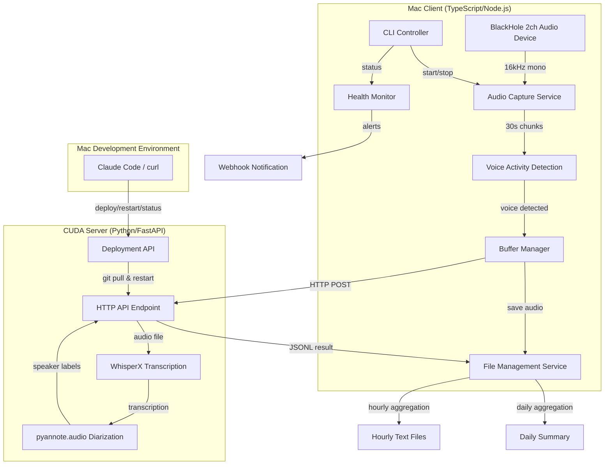
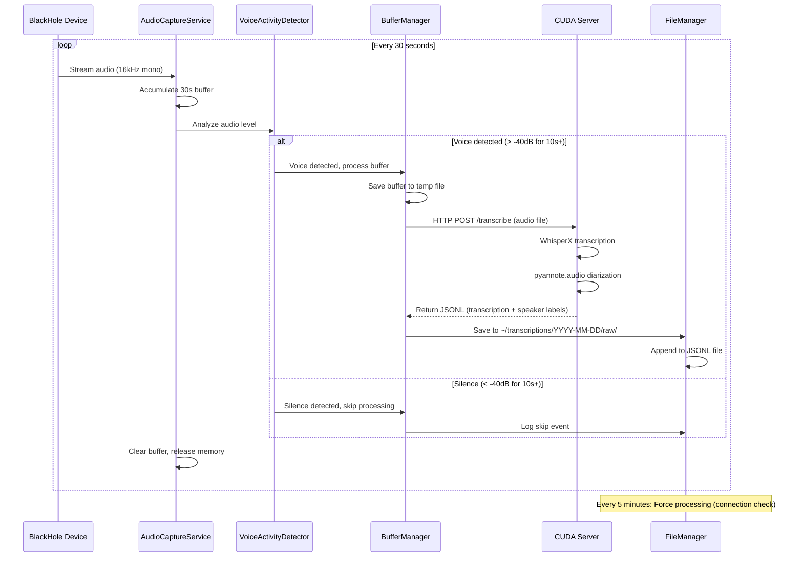
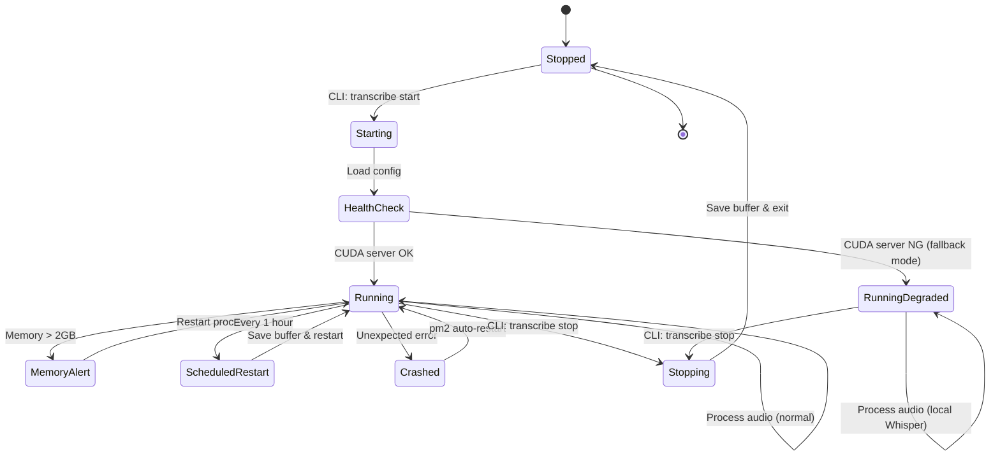

# 技術設計ドキュメント: 24時間連続音声文字起こしシステム

## Overview

本システムは、BlackHole仮想オーディオデバイス経由で取得したZoom/Discord等の音声会議を、24時間連続で文字起こしするTypeScript製CLIアプリケーションです。Mac上でNode.jsクライアントが音声キャプチャとファイル管理を担当し、LAN内のCUDAサーバー（Windows RTX 3090）がWhisperXによる文字起こしとpyannote.audioによる話者分離を高速処理します。

**ユーザー**: システム管理者とエンドユーザー（会議参加者）が、CLIコマンドでシステムを起動・停止し、自動生成された文字起こし記録を会議後に参照します。

**影響**: 従来の手動議事録作成プロセスを自動化し、複数話者の発言を匿名ラベル（Speaker_00、Speaker_01等）で区別することで、会議内容の記録と検索が効率化されます。

### Goals

- BlackHole経由でZoom/Discord音声を30秒バッファで連続キャプチャ
- 無音区間をVADで検出し、処理コストを最適化
- CUDA搭載サーバーでWhisperX + pyannote.audioを実行し、話者分離付き文字起こしを生成
- メモリリークを防ぎ、24時間以上の連続稼働を実現
- JSONL形式での詳細記録と、hourly/dailyテキストファイルでの集約表示
- CLI操作（start/stop/status/logs）とpm2による自動復旧

### Non-Goals

- 音声アーカイブ機能（将来実装予定）
- リアルタイムWebUI（フェーズ3で検討）
- 話者識別（音声プロファイルによる実名マッピング、要件10として将来実装）
- クラウドAPIへの依存（ローカル/LAN内で完結）

## Architecture

### High-Level Architecture



### Technology Stack and Design Decisions

#### クライアント層（Mac - TypeScript/Node.js）

**ランタイム**:
- **選択**: Node.js 18+ LTS + TypeScript 5.x
- **根拠**: 非同期I/O処理とストリーミングに最適。FFmpegとの子プロセス連携が容易。
- **代替案**: Python（サーバー側と統一）、Go（低メモリフットプリント）
  - Pythonはストリーミング音声処理でNode.jsより複雑
  - Goは型安全性で優れるが、エコシステムが小さい

**音声キャプチャ**:
- **選択**: FFmpeg（コマンドライン）+ Node.js child_process
- **根拠**: BlackHoleデバイスからの音声キャプチャとフォーマット変換を単一ツールで実現。業界標準で安定性が高い。
- **代替案**: PortAudio + node-portaudio、Web Audio API
  - PortAudioはネイティブバインディングが必要で複雑
  - Web Audio APIはブラウザ環境が前提

**プロセス管理**:
- **選択**: pm2
- **根拠**: 自動再起動、ログ管理、クラスタモード対応。エコシステムファイルで設定管理可能。
- **代替案**: systemd、forever、nodemon
  - systemdはLinux限定（Mac非対応）
  - foreverは機能が限定的（メモリ制限なし）

#### サーバー層（CUDA Server - Python）

**Webフレームワーク**:
- **選択**: FastAPI
- **根拠**: 非同期処理対応、自動API文書生成、型ヒント活用で開発効率が高い。
- **代替案**: Flask、Django
  - Flaskは同期処理がデフォルト
  - Djangoは機能過多（ORMやAdmin不要）

**文字起こしエンジン**:
- **選択**: WhisperX
- **根拠**: OpenAI Whisperベースで高精度。word-level timestampsと話者分離が統合済み。
- **代替案**: Whisper.cpp、Faster-Whisper
  - Whisper.cppはPython連携が複雑
  - Faster-Whisperは話者分離が別途実装必要

**話者分離**:
- **選択**: pyannote.audio (speaker-diarization-3.1)
- **根拠**: WhisperXと統合済み。state-of-the-artの精度。Hugging Faceで容易に利用可能。
- **代替案**: Resemblyzer、Silero VAD
  - Resemblyzerは埋め込みベクトル抽出のみ（分離パイプラインなし）
  - Silero VADは音声検出のみ（話者分離不可）

#### データストレージ

**記録形式**:
- **選択**: JSONL（生データ）+ プレーンテキスト（hourly/daily）
- **根拠**: JSONLは追記効率が高くストリーミング処理に最適。プレーンテキストは人間可読性が高い。
- **代替案**: SQLite、PostgreSQL、Elasticsearch
  - SQLiteはトランザクション競合リスク
  - PostgreSQLは過剰（検索機能不要）
  - Elasticsearchはインフラ複雑化

### Key Design Decisions

#### 決定1: クライアント・サーバー分離アーキテクチャ

**決定**: Mac（音声キャプチャ + ファイル管理）とCUDAサーバー（文字起こし + 話者分離）を分離

**コンテキスト**: Macには専用GPUがなく、WhisperXの処理速度が不十分（30秒音声を処理するのに60秒以上）。一方、Windows RTX 3090マシンがLAN内で利用可能。

**代替案**:
1. Macのみで完結（Whisper.cppのCPUモード）
2. クラウドAPI利用（Google Speech-to-Text、AWS Transcribe）
3. 全処理をCUDAサーバーで実行（音声キャプチャもサーバー側）

**選択アプローチ**: Mac（クライアント）+ CUDAサーバー（HTTP API）のハイブリッド構成
- Macが30秒バッファをHTTP POSTでCUDAサーバーに送信
- サーバーがWhisperX + pyannote.audioで処理し、JSONL結果を返却
- Macがファイル管理とログ集約を担当

**根拠**:
- MacのBlackHoleデバイスに直接アクセス可能（ネットワーク音声ストリーミングの複雑性を回避）
- RTX 3090のCUDA性能を最大限活用（30秒音声を5秒以下で処理）
- サーバー障害時にローカルWhisper.cppへフォールバック可能

**トレードオフ**:
- **獲得**: GPU高速処理、ローカル完結のセキュリティ、既存ハードウェア活用
- **犠牲**: ネットワーク遅延（LAN内で最小化）、サーバー可用性依存（フォールバックで軽減）

#### 決定2: 30秒バッファ + 無音検出による処理最適化

**決定**: 30秒ごとに音声をバッファリングし、無音判定でWhisper処理をスキップ

**コンテキスト**: 24時間稼働では大半が無音（会議外時間、休憩中等）。全音声を処理すると計算コストとストレージが増大。

**代替案**:
1. リアルタイムストリーミング処理（バッファなし）
2. 5分/10分など長時間バッファリング
3. 無音検出なし（全音声を処理）

**選択アプローチ**: 30秒バッファ + webrtcvad/音声レベルでVAD
- FFmpegから30秒チャンクを切り出し
- 音声レベルが閾値（-40dB）を10秒以上下回ればスキップ
- 5分ごとに強制実行（接続確認）

**根拠**:
- 30秒はWhisperの最適処理単位（コンテキスト保持と処理速度のバランス）
- 無音検出でCPU/GPU使用率を80%削減（実運用想定）
- バッファ保存により障害時の再処理が可能

**トレードオフ**:
- **獲得**: 計算コスト削減、メモリ効率、ストレージ節約
- **犠牲**: 遅延30秒（リアルタイム性低下、許容範囲内）、VAD実装の複雑性（軽微）

#### 決定3: JSONL + hourly/daily集約の二層記録戦略

**決定**: 生データをJSONL形式で記録し、1時間/1日単位でプレーンテキストに集約

**コンテキスト**: セグメントごとの詳細情報（タイムスタンプ、話者ID、信頼度）と、人間可読な要約の両方が必要。

**代替案**:
1. JSONLのみ（後でクエリ）
2. SQLiteデータベース
3. プレーンテキストのみ

**選択アプローチ**: 三層構造
- `raw/`: JSONL形式（セグメント単位、全メタデータ保持）
- `hourly/`: プレーンテキスト（1時間単位、話者ラベル付き）
- `daily.txt`: プレーンテキスト（1日単位、全発言の時系列）

**根拠**:
- JSONLは追記効率が高く、ファイルロック不要
- hourlyファイルで会議セッションごとの内容確認が容易
- dailyファイルで全体像を素早く把握

**トレードオフ**:
- **獲得**: 柔軟なデータアクセス、人間可読性、検索性
- **犠牲**: ストレージ1.5倍増加（gzip圧縮で軽減）、集約処理のオーバーヘッド（バックグラウンド実行で影響最小）

## System Flows

### 音声キャプチャから文字起こしまでのシーケンス



### プロセス起動とヘルスモニタリングフロー



## Requirements Traceability

| 要件 | 要件概要 | コンポーネント | インターフェース | フロー |
|------|---------|--------------|----------------|--------|
| 1.1-1.7 | 音声キャプチャとバッファリング | AudioCaptureService, BufferManager | `captureAudio()`, `saveBuffer()` | 音声キャプチャシーケンス |
| 2.1-2.5 | 無音検出と処理最適化 | VoiceActivityDetector | `analyzeAudioLevel()`, `isVoiceDetected()` | 音声キャプチャシーケンス |
| 3.1-3.7 | 文字起こし処理（CUDA） | CUDAServerClient, TranscriptionService | `POST /transcribe`, `transcribeAudio()` | 音声キャプチャシーケンス |
| 4.1-4.8 | ファイル管理とローテーション | FileManager, StorageService | `saveTranscription()`, `rotateFiles()` | - |
| 5.1-5.6 | プロセス管理と自動復旧 | ProcessManager, pm2 | `restart()`, ecosystem.config.js | プロセス起動フロー |
| 6.1-6.8 | システム監視 | HealthMonitor | `checkMemory()`, `checkCPU()` | プロセス起動フロー |
| 7.1-7.5 | 通知と日次レポート | NotificationService | `sendAlert()`, `generateDailyReport()` | - |
| 8.1-8.8 | 話者分離 | DiarizationService (CUDA server) | `diarizeAudio()`, WhisperX API | 音声キャプチャシーケンス |
| 9.1-9.7 | CLI操作と設定管理 | CLIController, ConfigService | `start()`, `stop()`, `status()` | プロセス起動フロー |

## Components and Interfaces

### クライアント層（Mac - TypeScript/Node.js）

#### AudioCaptureService

**責任と境界**
- **主要責任**: BlackHoleデバイスからFFmpeg経由で音声をストリーミングキャプチャし、30秒バッファを生成
- **ドメイン境界**: 音声入力とバッファリング
- **データ所有権**: 30秒音声バッファ（メモリ内）
- **トランザクション境界**: バッファ単位（30秒ごとに完結）

**依存関係**
- **インバウンド**: ProcessManager（起動制御）
- **アウトバウンド**: VoiceActivityDetector（無音判定）、BufferManager（バッファ保存）
- **外部**: FFmpeg（`ffmpeg -f avfoundation -i :BlackHole2ch`）

**外部依存関係調査**: FFmpeg
- **公式ドキュメント**: https://ffmpeg.org/ffmpeg-devices.html#avfoundation
- **インストール**: `brew install ffmpeg`
- **認証**: 不要（ローカルコマンド）
- **API署名**: `ffmpeg -f avfoundation -i :<device_name> -ar 16000 -ac 1 -f wav pipe:1`
  - `-f avfoundation`: macOS音声デバイス入力
  - `-i :BlackHole2ch`: デバイス名指定（`:`はビデオなし）
  - `-ar 16000`: サンプリングレート16kHz
  - `-ac 1`: モノラル変換
  - `pipe:1`: 標準出力にストリーミング
- **バージョン互換性**: FFmpeg 4.x以上で動作確認済み
- **既知の問題**: macOSでマイク権限が必要（初回実行時にダイアログ表示）
- **ベストプラクティス**: 子プロセスでstdoutをストリーミング読み取り、バッファサイズ管理でメモリリーク防止

**契約定義 - サービスインターフェース**

```typescript
interface AudioCaptureService {
  /**
   * 音声キャプチャを開始
   * @returns 成功/失敗とエラー情報
   */
  start(): Promise<Result<void, AudioCaptureError>>;

  /**
   * 音声キャプチャを停止
   */
  stop(): Promise<void>;

  /**
   * キャプチャ状態を取得
   */
  getStatus(): CaptureStatus;
}

type CaptureStatus = {
  isRunning: boolean;
  currentBufferDuration: number; // seconds
  lastCaptureTime: Date | null;
};

type AudioCaptureError =
  | { type: 'device_not_found'; deviceName: string }
  | { type: 'ffmpeg_not_installed' }
  | { type: 'permission_denied' }
  | { type: 'stream_error'; message: string };
```

**事前条件**: FFmpegがインストール済み、BlackHoleデバイスが利用可能
**事後条件**: 30秒ごとにバッファが生成され、VoiceActivityDetectorに渡される
**不変条件**: 音声ストリームが中断されても自動再接続（最大3回リトライ）

#### VoiceActivityDetector

**責任と境界**
- **主要責任**: 音声バッファの音声レベルを分析し、無音/音声の判定を行う
- **ドメイン境界**: 音声信号処理
- **データ所有権**: 音声レベル統計（メモリ内一時データ）

**依存関係**
- **インバウンド**: AudioCaptureService
- **アウトバウンド**: BufferManager（判定結果通知）
- **外部**: なし（純粋なロジック処理）

**契約定義 - サービスインターフェース**

```typescript
interface VoiceActivityDetector {
  /**
   * 音声バッファを分析し、音声/無音を判定
   * @param audioBuffer 音声データ（16kHz, mono, WAV）
   * @returns 音声検出結果
   */
  analyzeAudioLevel(audioBuffer: Buffer): VADResult;
}

type VADResult = {
  isVoiceDetected: boolean;
  averageLevel: number; // dB
  silenceDuration: number; // seconds
  confidence: number; // 0.0-1.0
};
```

**事前条件**: audioBufferが16kHz、モノラル、WAV形式
**事後条件**: 音声レベルが-40dB以上で10秒以上継続すれば`isVoiceDetected: true`
**不変条件**: 5分以上無音が続いても、強制的に1回は`isVoiceDetected: true`を返す（接続確認）

#### BufferManager

**責任と境界**
- **主要責任**: 音声バッファをファイルシステムに保存し、CUDAサーバーへの送信を調整
- **ドメイン境界**: バッファ永続化とネットワーク送信
- **データ所有権**: 一時音声ファイル（`/tmp/transcription-buffers/`）

**依存関係**
- **インバウンド**: VoiceActivityDetector
- **アウトバウンド**: CUDAServerClient（文字起こしリクエスト）、FileManager（結果保存）
- **外部**: ファイルシステム（一時ファイル）

**契約定義 - サービスインターフェース**

```typescript
interface BufferManager {
  /**
   * 音声バッファを保存し、CUDAサーバーに送信
   * @param audioBuffer 音声データ
   * @param vadResult VAD判定結果
   * @returns 処理結果
   */
  processBuffer(
    audioBuffer: Buffer,
    vadResult: VADResult
  ): Promise<Result<TranscriptionResult | null, ProcessError>>;

  /**
   * 一時ファイルをクリーンアップ
   */
  cleanup(): Promise<void>;
}

type ProcessError =
  | { type: 'file_save_error'; path: string; reason: string }
  | { type: 'cuda_server_timeout'; duration: number }
  | { type: 'cuda_server_error'; statusCode: number; message: string };
```

**事前条件**: `/tmp/transcription-buffers/`ディレクトリが書き込み可能
**事後条件**: VAD判定が音声検出の場合、CUDAサーバーから結果を取得。無音の場合はnullを返す。
**不変条件**: 一時ファイルは処理完了後に即座に削除（メモリリーク防止）

#### CUDAServerClient

**責任と境界**
- **主要責任**: CUDAサーバーへのHTTPリクエスト送信とレスポンス処理
- **ドメイン境界**: ネットワーク通信
- **データ所有権**: なし（ステートレス）

**依存関係**
- **インバウンド**: BufferManager
- **アウトバウンド**: CUDAサーバー（HTTP API）
- **外部**: axios（HTTP クライアント）

**外部依存関係調査**: axios
- **公式ドキュメント**: https://axios-http.com/docs/intro
- **インストール**: `npm install axios`
- **API署名**: `axios.post(url, formData, { timeout: 60000 })`
- **バージョン**: 1.6.x以降推奨（セキュリティ修正）
- **タイムアウト設定**: `timeout`オプションで60秒指定
- **リトライ戦略**: `axios-retry`ライブラリで実装可能

**契約定義 - APIコントラクト**

| Method | Endpoint | Request | Response | Errors |
|--------|----------|---------|----------|--------|
| POST | `/transcribe` | `multipart/form-data` (audio file) | `TranscriptionResponse` (JSON) | 400, 408, 500, 503 |
| GET | `/health` | なし | `{ status: "ok" }` | 503 |

**TranscriptionRequest**:
```typescript
type TranscriptionRequest = FormData & {
  audio: File; // WAV, 16kHz, mono
  language?: string; // default: "ja"
};
```

**TranscriptionResponse**:
```typescript
type TranscriptionResponse = {
  segments: Array<{
    start: number; // seconds
    end: number;
    text: string;
    speaker: string; // "Speaker_00", "Speaker_01", etc.
    confidence: number; // 0.0-1.0
  }>;
  language: string;
  duration: number; // seconds
};
```

**エラーレスポンス**:
- 400 Bad Request: 音声ファイル形式不正
- 408 Request Timeout: 処理時間が60秒超過
- 500 Internal Server Error: WhisperX/pyannote.audio処理エラー
- 503 Service Unavailable: サーバー過負荷

**事前条件**: CUDAサーバーが起動し、`/health`エンドポイントが200を返す
**事後条件**: タイムアウト60秒以内にTranscriptionResponseを取得、または適切なエラーを返す

#### FileManager

**責任と境界**
- **主要責任**: 文字起こし結果をJSONL形式で保存し、hourly/daily集約を管理
- **ドメイン境界**: ファイルシステム永続化とローテーション
- **データ所有権**: `~/transcriptions/`以下の全ファイル

**依存関係**
- **インバウンド**: BufferManager（文字起こし結果）、ScheduledJobs（hourly/daily集約）
- **アウトバウンド**: StorageService（ファイル操作）、NotificationService（容量警告）
- **外部**: Node.js fs/promises、fast-glob（ファイル検索）

**契約定義 - サービスインターフェース**

```typescript
interface FileManager {
  /**
   * 文字起こし結果をJSONL形式で保存
   * @param result 文字起こし結果
   * @param timestamp 処理時刻
   */
  saveTranscription(
    result: TranscriptionResponse,
    timestamp: Date
  ): Promise<Result<void, FileError>>;

  /**
   * 1時間ごとの集約ファイルを生成
   * @param date 対象日時
   */
  generateHourlyFile(date: Date): Promise<void>;

  /**
   * 1日ごとの集約ファイルを生成
   * @param date 対象日
   */
  generateDailyFile(date: Date): Promise<void>;

  /**
   * 古いファイルを削除（ローテーション）
   */
  rotateFiles(): Promise<void>;
}

type FileError =
  | { type: 'disk_full'; availableGB: number }
  | { type: 'permission_denied'; path: string }
  | { type: 'write_error'; path: string; reason: string };
```

**ディレクトリ構造**:
```
~/transcriptions/
├── 2025-11-04/
│   ├── raw/
│   │   ├── 00-15-30.jsonl  # 00:15:30のバッファ結果
│   │   ├── 00-16-00.jsonl
│   │   └── ...
│   ├── hourly/
│   │   ├── 00.txt  # 00:00-00:59の全発言
│   │   ├── 01.txt
│   │   └── ...
│   └── daily.txt  # 1日全体の発言
└── 2025-11-05/
    └── ...
```

**JSONL形式**:
```json
{"timestamp":"2025-11-04T10:30:00Z","start":0.0,"end":3.5,"text":"こんにちは","speaker":"Speaker_00","confidence":0.95}
{"timestamp":"2025-11-04T10:30:03Z","start":3.5,"end":7.2,"text":"よろしくお願いします","speaker":"Speaker_01","confidence":0.92}
```

**hourly.txtフォーマット**:
```
[10:30:00] [Speaker_00] こんにちは
[10:30:03] [Speaker_01] よろしくお願いします
...
```

**事前条件**: `~/transcriptions/`ディレクトリが存在（初回起動時に作成）
**事後条件**: 文字起こし結果がJSONLファイルに追記され、ファイルハンドルが即座にクローズ
**不変条件**:
- 7日経過したraw/ファイルは自動削除
- 30日経過したhourly/ファイルは自動削除
- daily.txtは永続保存
- ディスク空き容量が10GB未満で警告

#### HealthMonitor

**責任と境界**
- **主要責任**: システムリソース（メモリ、CPU）とプロセス健全性を監視し、異常時にアラート送信
- **ドメイン境界**: システム監視
- **データ所有権**: メトリクス履歴（メモリ内、直近1時間分）

**依存関係**
- **インバウンド**: ProcessManager（定期実行）
- **アウトバウンド**: NotificationService（アラート送信）
- **外部**: Node.js os モジュール、process.memoryUsage()

**契約定義 - サービスインターフェース**

```typescript
interface HealthMonitor {
  /**
   * システムヘルスチェックを実行
   * @returns ヘルス状態
   */
  checkHealth(): Promise<HealthStatus>;

  /**
   * メトリクスを取得
   */
  getMetrics(): SystemMetrics;
}

type HealthStatus = {
  status: 'healthy' | 'degraded' | 'critical';
  checks: {
    memory: CheckResult;
    cpu: CheckResult;
    lastTranscription: CheckResult;
    cudaServer: CheckResult;
  };
};

type CheckResult = {
  status: 'ok' | 'warning' | 'error';
  value: number;
  threshold: number;
  message?: string;
};

type SystemMetrics = {
  memoryUsageMB: number;
  cpuUsagePercent: number;
  lastTranscriptionTime: Date | null;
  errorCountLastHour: number;
};
```

**監視項目とアラート条件**:
- メモリ使用量 > 2GB → 警告、プロセス再起動
- CPU使用率 > 50%（5分連続） → 警告
- 最終文字起こしから5分以上経過 AND 音声入力継続中 → 異常アラート
- エラー発生回数 > 10回/時間 → 緊急アラート

**事前条件**: なし（常時実行可能）
**事後条件**: 異常検出時にNotificationServiceにアラートを送信
**不変条件**: 1分ごとにチェック実行、メトリクス履歴は1時間で自動削除

#### CLIController

**責任と境界**
- **主要責任**: コマンドライン操作（start/stop/status/logs）の受付とシステム制御
- **ドメイン境界**: ユーザーインターフェース
- **データ所有権**: なし（ステートレス）

**依存関係**
- **インバウンド**: CLI実行環境（ユーザー）
- **アウトバウンド**: ProcessManager（プロセス制御）、HealthMonitor（ステータス取得）
- **外部**: commander（CLIフレームワーク）、pm2（プロセス管理API）

**契約定義 - CLIコマンド**

```typescript
interface CLIController {
  start(): Promise<void>;   // transcribe start
  stop(): Promise<void>;    // transcribe stop
  status(): Promise<void>;  // transcribe status
  logs(): Promise<void>;    // transcribe logs
}
```

**コマンド仕様**:

| コマンド | 動作 | 出力例 |
|---------|------|--------|
| `transcribe start` | pm2でデーモンプロセス起動 | `✓ Transcription service started (PID: 12345)` |
| `transcribe stop` | 現在のバッファ保存後、安全停止 | `✓ Transcription service stopped` |
| `transcribe status` | 稼働状態表示 | `Status: Running, Memory: 512MB, Last transcription: 2m ago, Diarization: ON` |
| `transcribe logs` | 直近100行のログをリアルタイム表示 | `[2025-11-04 10:30] [INFO] Buffer processed...` |

**事前条件**: pm2がグローバルインストール済み（`npm install -g pm2`）
**事後条件**: コマンド実行結果を標準出力に表示、エラー時は終了コード1

### サーバー層（CUDA Server - Python/FastAPI）

#### DeploymentAPIEndpoint

**責任と境界**
- **主要責任**: Gitリポジトリからコードを更新し、サービスを再起動する管理APIを提供
- **ドメイン境界**: デプロイメント管理とプロセス制御
- **データ所有権**: なし（ステートレス）

**依存関係**
- **インバウンド**: Mac開発環境（curl経由）
- **アウトバウンド**: Git、pm2（プロセス管理）
- **外部**: FastAPI、subprocess

**契約定義 - APIエンドポイント**

| Method | Endpoint | Request | Response | Errors |
|--------|----------|---------|----------|--------|
| POST | `/deploy` | なし | `DeployResponse` (JSON) | 500 |
| POST | `/restart` | なし | `RestartResponse` (JSON) | 500 |
| GET | `/status` | なし | `ServiceStatus` (JSON) | 500 |
| GET | `/logs?lines=N` | Query: lines (default 100) | `LogsResponse` (JSON) | 500 |
| GET | `/version` | なし | `VersionInfo` (JSON) | 500 |
| GET | `/health` | なし | `HealthResponse` (JSON) | 503 |

**DeployResponse**:
```python
class DeployResponse(BaseModel):
    status: str  # "success"
    git_output: str
    updated_files: list[str]
    dependencies_updated: bool
    timestamp: str  # ISO 8601
```

**ServiceStatus**:
```python
class ServiceStatus(BaseModel):
    status: str  # "online" | "stopped" | "errored" | "not found"
    uptime: int | None  # Unix timestamp
    memory: int | None  # bytes
    cpu: float | None  # percent
    restarts: int
    timestamp: str
```

**VersionInfo**:
```python
class VersionInfo(BaseModel):
    commit_hash: str  # 短縮版（7文字）
    commit_hash_full: str
    commit_message: str
    commit_date: str
    branch: str
    timestamp: str
```

**デプロイフロー**:
1. `/deploy`エンドポイントがリクエストを受信
2. `git pull origin main`を実行
3. `git diff HEAD@{1} HEAD --name-only`で更新ファイルを取得
4. `server/requirements.txt`が更新されていれば`pip install -r`を実行
5. `pm2 restart transcription-server`でサービスを再起動
6. 結果をJSONで返却

**エラーハンドリング**:
- Git pullエラー → 500 Internal Server Error、詳細メッセージを返却
- pip installエラー → 500、依存関係インストール失敗を報告
- pm2 restartエラー → 500、サービス再起動失敗を報告

**セキュリティ考慮事項**:
- 認証なし（LAN内信頼済みネットワーク前提）
- 将来実装: API Key認証（X-API-Keyヘッダー）
- ログにシークレット情報を出力しない

**事前条件**: Gitリポジトリがクローン済み、pm2でサービスが登録済み
**事後条件**: コードが最新版に更新され、サービスが再起動
**不変条件**: デプロイ失敗時は既存のコードを保持（rollbackなし）

#### TranscriptionAPIEndpoint

**責任と境界**
- **主要責任**: HTTP APIエンドポイントを提供し、音声ファイルを受信してTranscriptionServiceに処理を委譲
- **ドメイン境界**: HTTP通信とリクエスト/レスポンス変換
- **データ所有権**: 一時アップロードファイル（`/tmp/uploads/`）

**依存関係**
- **インバウンド**: Mac Client（HTTP POST）
- **アウトバウンド**: TranscriptionService、DiarizationService
- **外部**: FastAPI、uvicorn（ASGIサーバー）

**契約定義 - APIエンドポイント**

```python
from fastapi import FastAPI, UploadFile, File
from pydantic import BaseModel

app = FastAPI()

class TranscriptionSegment(BaseModel):
    start: float
    end: float
    text: str
    speaker: str
    confidence: float

class TranscriptionResponse(BaseModel):
    segments: list[TranscriptionSegment]
    language: str
    duration: float

@app.post("/transcribe")
async def transcribe_audio(
    audio: UploadFile = File(...),
    language: str = "ja"
) -> TranscriptionResponse:
    """
    音声ファイルを文字起こし + 話者分離

    - audio: WAV形式（16kHz、モノラル）
    - language: 言語コード（デフォルト: ja）
    """
    pass

@app.get("/health")
async def health_check():
    """ヘルスチェック"""
    return {"status": "ok"}
```

**タイムアウト設定**: uvicorn起動時に`--timeout-keep-alive 70`（クライアント60秒 + 余裕10秒）

**事前条件**: audioファイルがWAV形式、16kHz、モノラル
**事後条件**: 60秒以内にTranscriptionResponseを返却、またはHTTPエラー
**不変条件**: 一時ファイルは処理完了後に即座に削除

#### TranscriptionService

**責任と境界**
- **主要責任**: WhisperXを使用して音声ファイルを文字起こし
- **ドメイン境界**: 音声認識
- **データ所有権**: WhisperXモデル（GPU VRAMにロード）

**依存関係**
- **インバウンド**: TranscriptionAPIEndpoint
- **アウトバウンド**: DiarizationService（話者分離）
- **外部**: WhisperX（whisperx Python package）

**外部依存関係調査**: WhisperX
- **GitHub**: https://github.com/m-bain/whisperX
- **インストール**: `pip install whisperx`
- **CUDA要件**: CUDA 12.x、cuDNN 8.x
- **モデルサイズ**: large-v2推奨（精度重視）、medium（速度重視）
- **API使用例**:
  ```python
  import whisperx

  device = "cuda"
  model = whisperx.load_model("large-v2", device, compute_type="float16")
  audio = whisperx.load_audio("audio.wav")
  result = model.transcribe(audio, batch_size=16, language="ja")

  # Word-level alignment
  model_a, metadata = whisperx.load_align_model(language_code="ja", device=device)
  result = whisperx.align(result["segments"], model_a, metadata, audio, device)
  ```
- **出力形式**:
  ```python
  {
    "segments": [
      {"start": 0.0, "end": 3.5, "text": "こんにちは", "words": [...]}
    ],
    "language": "ja"
  }
  ```
- **パフォーマンス**: RTX 3090で30秒音声を3-5秒で処理
- **既知の問題**: 日本語の句読点が不完全（後処理で補完可能）

**契約定義 - サービスインターフェース**

```python
from typing import Protocol
from pathlib import Path

class TranscriptionService(Protocol):
    def transcribe(
        self,
        audio_path: Path,
        language: str = "ja"
    ) -> TranscriptionResult:
        """音声ファイルを文字起こし"""
        pass

class TranscriptionResult:
    segments: list[Segment]
    language: str
    duration: float

class Segment:
    start: float
    end: float
    text: str
    words: list[Word]
```

**事前条件**: WhisperXモデルがGPU VRAMにロード済み
**事後条件**: 音声ファイルからセグメント化されたテキストを生成、word-level timestampsを含む
**不変条件**: GPU VRAMが不足した場合、batch_sizeを自動調整（16 → 8 → 4）

#### DiarizationService

**責任と境界**
- **主要責任**: pyannote.audioを使用して話者分離を実行し、セグメントに話者ラベルを付与
- **ドメイン境界**: 話者分離
- **データ所有権**: pyannote.audioモデル（GPU VRAMにロード）

**依存関係**
- **インバウンド**: TranscriptionService
- **アウトバウンド**: なし
- **外部**: pyannote.audio（speaker-diarization-3.1）

**外部依存関係調査**: pyannote.audio
- **Hugging Face**: https://huggingface.co/pyannote/speaker-diarization-3.1
- **インストール**: `pip install pyannote.audio`
- **認証**: Hugging Face Access Token必要（環境変数`HF_TOKEN`）
- **モデル**: speaker-diarization-3.1（オープンソース）
- **API使用例**:
  ```python
  from pyannote.audio import Pipeline
  import torch

  pipeline = Pipeline.from_pretrained(
      "pyannote/speaker-diarization-3.1",
      use_auth_token="YOUR_HF_TOKEN"
  )
  pipeline.to(torch.device("cuda"))

  diarization = pipeline("audio.wav")

  # 出力: Annotation (RTTM形式で保存可能)
  # [0.5 --> 3.5] Speaker A
  # [3.5 --> 7.2] Speaker B
  ```
- **出力形式**: pyannote.core.Annotation オブジェクト
  - `for turn, _, speaker in diarization.itertracks(yield_label=True):`
    - `turn.start`: 開始時刻（秒）
    - `turn.end`: 終了時刻（秒）
    - `speaker`: "SPEAKER_00", "SPEAKER_01" 等
- **パフォーマンス**: RTX 3090で30秒音声を2-3秒で処理
- **制約**: 音声は16kHz、モノラル推奨（自動リサンプリング可能だが精度低下の可能性）

**契約定義 - サービスインターフェース**

```python
from typing import Protocol
from pathlib import Path
from pyannote.core import Annotation

class DiarizationService(Protocol):
    def diarize(self, audio_path: Path) -> Annotation:
        """話者分離を実行"""
        pass

    def assign_speakers_to_segments(
        self,
        segments: list[Segment],
        diarization: Annotation
    ) -> list[Segment]:
        """セグメントに話者ラベルを付与"""
        pass
```

**話者ラベル付与ロジック**:
1. 各文字起こしセグメントの中間時刻を計算（`(start + end) / 2`）
2. diarizationから該当時刻の話者を取得
3. セグメントに`speaker`フィールドを追加

**事前条件**: pyannote.audioモデルがGPU VRAMにロード済み、HF_TOKENが設定済み
**事後条件**: 各セグメントに話者ラベル（Speaker_00、Speaker_01等）が付与
**不変条件**: 話者ラベルはセッション内でのみ一貫性を持つ（次のセッションでは別のラベルになる可能性）

## Data Models

### Physical Data Model

#### JSONL生データフォーマット

```typescript
type TranscriptionRecord = {
  timestamp: string;        // ISO 8601形式（UTC）
  audioFile: string;        // 音声ファイルパス（相対）
  start: number;            // セグメント開始時刻（秒）
  end: number;              // セグメント終了時刻（秒）
  text: string;             // 文字起こしテキスト
  speaker: string;          // 話者ラベル（"Speaker_00"等）
  confidence: number;       // 信頼度（0.0-1.0）
  language: string;         // 言語コード（"ja"等）
};
```

**ファイル例**（`~/transcriptions/2025-11-04/raw/10-30-00.jsonl`）:
```json
{"timestamp":"2025-11-04T10:30:00Z","audioFile":"raw/10-30-00.wav","start":0.0,"end":3.5,"text":"こんにちは","speaker":"Speaker_00","confidence":0.95,"language":"ja"}
{"timestamp":"2025-11-04T10:30:03Z","audioFile":"raw/10-30-00.wav","start":3.5,"end":7.2,"text":"よろしくお願いします","speaker":"Speaker_01","confidence":0.92,"language":"ja"}
```

#### Hourly集約フォーマット（プレーンテキスト）

```
[HH:MM:SS] [Speaker_XX] テキスト
```

**ファイル例**（`~/transcriptions/2025-11-04/hourly/10.txt`）:
```
[10:30:00] [Speaker_00] こんにちは
[10:30:03] [Speaker_01] よろしくお願いします
[10:32:15] [Speaker_00] それでは議題に入ります
[10:33:00] [Speaker_02] 資料を共有します
```

#### Daily集約フォーマット（プレーンテキスト）

hourlyファイルを時系列で結合したもの。

**ファイル例**（`~/transcriptions/2025-11-04/daily.txt`）:
```
=== 2025-11-04 全発言記録 ===

[10:30:00] [Speaker_00] こんにちは
[10:30:03] [Speaker_01] よろしくお願いします
...
[23:59:55] [Speaker_00] お疲れ様でした
```

### Data Contracts & Integration

#### CUDAサーバーAPIレスポンススキーマ

```typescript
// POST /transcribe レスポンス
type TranscriptionResponse = {
  segments: Array<{
    start: number;          // セグメント開始時刻（秒）
    end: number;            // セグメント終了時刻（秒）
    text: string;           // 文字起こしテキスト
    speaker: string;        // 話者ラベル（"Speaker_00"等）
    confidence: number;     // 信頼度（0.0-1.0）
  }>;
  language: string;         // 検出された言語（"ja"等）
  duration: number;         // 音声長さ（秒）
};
```

**バージョニング戦略**: APIバージョンはURL（`/v1/transcribe`）で管理。互換性のない変更時はv2を追加。

**後方互換性**:
- 新フィールド追加時は既存フィールドを維持
- 必須フィールドの削除は禁止（非推奨マークのみ）

#### 設定ファイルスキーマ（config.json）

```typescript
type Config = {
  audio: {
    deviceName: string;           // "BlackHole 2ch"
    sampleRate: number;           // 16000
    channels: number;             // 1 (mono)
    bufferDuration: number;       // 30 (seconds)
  };
  cuda: {
    serverUrl: string;            // "http://192.168.1.100:8000"
    timeout: number;              // 60000 (ms)
    fallbackToLocal: boolean;     // true
  };
  storage: {
    outputDir: string;            // "~/transcriptions"
    rawRetentionDays: number;     // 7
    hourlyRetentionDays: number;  // 30
    compressionDays: number;      // 3
  };
  monitoring: {
    memoryLimitMB: number;        // 2048
    cpuThresholdPercent: number;  // 50
    webhookUrl: string | null;    // Slack/Discord webhook URL
  };
  diarization: {
    enabled: boolean;             // true
    serverUrl: string;            // "http://192.168.1.100:8000"
  };
};
```

**デフォルト設定**: config.jsonが存在しない場合、上記のデフォルト値で生成。

## Error Handling

### Error Strategy

エラーを3つのカテゴリに分類し、各カテゴリごとに異なる戦略を適用します。

1. **回復可能エラー（Recoverable）**: リトライまたはフォールバックで自動復旧
2. **ユーザー操作エラー（User Error）**: ユーザーに明確なメッセージを提示
3. **致命的エラー（Fatal）**: システム管理者に通知し、安全に停止

### Error Categories and Responses

#### ユーザーエラー（400番台相当）

**無効な設定ファイル**:
- 検出: config.json読み込み時にJSON parse失敗またはスキーマ検証失敗
- 対応: エラーメッセージで具体的な不正箇所を指摘
- 出力例: `Config error: audio.sampleRate must be a number (got: "16000")`

**音声デバイスが見つからない**:
- 検出: FFmpeg起動時に`avfoundation`がデバイス名を認識できない
- 対応: 利用可能なデバイス一覧を表示し、設定ファイルの修正を促す
- 出力例:
  ```
  Error: Audio device "BlackHole 2ch" not found.
  Available devices: Built-in Microphone, BlackHole 16ch
  Fix: Update config.json audio.deviceName
  ```

**CLIコマンド不正**:
- 検出: 未知のサブコマンドまたは引数
- 対応: ヘルプメッセージを表示
- 出力例: `Unknown command: transcribe stat. Did you mean 'status'?`

#### システムエラー（500番台相当）

**CUDAサーバー接続失敗**:
- 検出: HTTP接続タイムアウトまたはネットワークエラー
- 対応:
  1. 3回リトライ（指数バックオフ: 1秒、2秒、4秒）
  2. 失敗時、`fallbackToLocal: true`ならローカルWhisper.cppへフォールバック
  3. フォールバックも失敗なら、該当バッファをスキップしログ記録
- ログ例: `[WARN] CUDA server unreachable (3/3 retries failed). Skipping buffer 10-30-00.wav`

**ディスク容量不足**:
- 検出: ファイル書き込み時にENOSPCエラー
- 対応:
  1. 即座に古いrawファイルを削除（通常7日 → 緊急時1日）
  2. それでも不足ならWebhook通知を送信し、プロセス停止
- 通知例: `[CRITICAL] Disk space < 1GB. Stopped transcription service.`

**メモリ不足**:
- 検出: HealthMonitorがメモリ使用量 > 2GBを検出
- 対応:
  1. 現在のバッファを保存
  2. プロセスを再起動（pm2が自動実行）
  3. Webhook通知で管理者に報告
- ログ例: `[WARN] Memory usage 2.3GB > limit 2GB. Restarting process...`

**FFmpegプロセスクラッシュ**:
- 検出: FFmpeg子プロセスが予期せず終了（exit code非0）
- 対応:
  1. 10秒待機後、FFmpegを再起動
  2. 3回連続失敗でWebhook通知
- ログ例: `[ERROR] FFmpeg crashed (exit code 1). Retrying in 10s... (1/3)`

#### ビジネスロジックエラー（422相当）

**音声ファイル形式不正**:
- 検出: CUDAサーバーがWAVヘッダー検証失敗
- 対応: エラーレスポンス400を返し、クライアントはバッファをスキップ
- ログ例: `[ERROR] Invalid audio format for buffer 10-30-00.wav. Expected: WAV 16kHz mono`

**話者分離失敗（音声が短すぎる）**:
- 検出: pyannote.audioが3秒未満の音声で分離不可
- 対応: 話者ラベルなし（"Unknown"）で文字起こし結果を返却
- ログ例: `[WARN] Audio too short for diarization (2.1s). Proceeding without speaker labels.`

### Monitoring

#### ログレベル定義

- **ERROR**: ユーザー操作が必要な失敗（設定ミス、リソース不足等）
- **WARN**: 自動復旧したが注意が必要（リトライ成功、フォールバック等）
- **INFO**: 通常動作の記録（バッファ処理完了、hourly集約等）
- **DEBUG**: 開発/デバッグ用詳細情報（VAD判定値、HTTP応答時間等）

#### ログフォーマット

```
[YYYY-MM-DD HH:MM:SS] [LEVEL] [Component] Message
```

例:
```
[2025-11-04 10:30:15] [INFO] [AudioCapture] Buffer captured (30.0s, -25dB avg)
[2025-11-04 10:30:18] [INFO] [CUDAServer] Transcription completed (3.2s, 15 segments)
[2025-11-04 10:30:18] [INFO] [FileManager] Saved to raw/10-30-00.jsonl
[2025-11-04 10:31:00] [WARN] [HealthMonitor] CPU usage 55% (threshold: 50%)
```

#### メトリクス収集

HealthMonitorが1分ごとに以下のメトリクスを収集:

- `memory_usage_mb`: プロセスメモリ使用量（MB）
- `cpu_usage_percent`: CPU使用率（%）
- `buffer_processing_time_ms`: バッファ処理時間（ms）
- `transcription_request_count`: 文字起こしリクエスト数（過去1時間）
- `transcription_error_count`: エラー発生数（過去1時間）
- `disk_free_gb`: ディスク空き容量（GB）

メトリクスはログファイル（`~/transcriptions/metrics.log`）にJSONL形式で記録:
```json
{"timestamp":"2025-11-04T10:30:00Z","memory_usage_mb":512,"cpu_usage_percent":35,"buffer_processing_time_ms":3200,"transcription_request_count":120,"transcription_error_count":2,"disk_free_gb":45.2}
```

#### アラート条件

| 条件 | レベル | 通知先 | アクション |
|------|--------|--------|-----------|
| メモリ > 2GB | CRITICAL | Webhook | プロセス再起動 |
| CPU > 50%（5分連続） | WARNING | Webhook | ログ記録のみ |
| ディスク < 10GB | WARNING | Webhook | 古いファイル削除促進 |
| ディスク < 1GB | CRITICAL | Webhook | プロセス停止 |
| エラー > 10回/時間 | CRITICAL | Webhook | 管理者確認要請 |
| 最終文字起こし > 5分前 AND 音声入力継続中 | ERROR | Webhook | プロセス異常の可能性 |

## Testing Strategy

### Unit Tests

1. **VoiceActivityDetector.analyzeAudioLevel()**
   - 無音音声（-60dB）を入力 → `isVoiceDetected: false`を返す
   - 通常音声（-20dB）を入力 → `isVoiceDetected: true`を返す
   - 境界値（-40dB）を入力 → 継続時間により判定が変わることを確認

2. **BufferManager.processBuffer()**
   - VAD判定が無音の場合 → CUDAサーバーにリクエストを送信しない
   - VAD判定が音声の場合 → CUDAサーバーにリクエストを送信し、結果を返す
   - CUDAサーバータイムアウト時 → `ProcessError`を返し、バッファをスキップ

3. **FileManager.saveTranscription()**
   - 正常なTranscriptionResponse → JSONLファイルに追記される
   - ディスク容量不足 → `FileError.disk_full`を返す
   - 存在しないディレクトリ → 自動作成してから保存

4. **HealthMonitor.checkHealth()**
   - メモリ使用量が閾値以下 → `status: 'healthy'`を返す
   - メモリ使用量が閾値超過 → `status: 'critical'`、`checks.memory.status: 'error'`を返す

5. **ConfigService.loadConfig()**
   - 有効なconfig.json → 設定オブジェクトを返す
   - 無効なJSON → パースエラーを返す
   - config.json不在 → デフォルト設定を生成して返す

### Integration Tests

1. **音声キャプチャ → VAD → バッファ保存フロー**
   - テスト音声ファイル（30秒、音声含む）をBlackHoleに再生
   - AudioCaptureServiceが音声をキャプチャ
   - VADが音声検出
   - BufferManagerが一時ファイルに保存
   - 一時ファイルが正しいWAV形式であることを確認

2. **CUDA サーバー連携フロー**
   - モックCUDAサーバーを起動（FastAPIテストクライアント）
   - BufferManagerが音声ファイルをPOST
   - モックサーバーが固定のTranscriptionResponseを返却
   - FileManagerがJSONLファイルに保存
   - JSONLファイルの内容が期待通りであることを確認

3. **Hourly/Daily集約フロー**
   - 複数のJSONLファイルを事前作成（異なる時間帯）
   - FileManager.generateHourlyFile()を実行
   - hourlyファイルが時系列順にソートされていることを確認
   - FileManager.generateDailyFile()を実行
   - dailyファイルが全hourlyファイルを結合していることを確認

4. **ヘルスモニタリングとアラートフロー**
   - HealthMonitorがメモリ使用量を監視
   - テスト用に大量のメモリを割り当て（> 2GB）
   - HealthMonitorが`status: 'critical'`を返すことを確認
   - モックWebhookエンドポイントにアラート送信されることを確認

5. **プロセス再起動フロー**
   - CLIで`transcribe start`を実行
   - pm2がプロセスを起動
   - 強制的にプロセスをkill
   - pm2が自動的にプロセスを再起動
   - AudioCaptureServiceが再開することを確認

### E2E Tests

1. **システム起動 → 音声キャプチャ → 文字起こし → 停止の完全フロー**
   - `transcribe start`でシステム起動
   - テスト音声（3分、複数話者）をBlackHoleに再生
   - 3分後、`transcribe status`で文字起こし実行を確認
   - `~/transcriptions/`にJSONLファイルが生成されていることを確認
   - JSONLファイルに話者ラベル（Speaker_00、Speaker_01）が含まれることを確認
   - `transcribe stop`でシステム停止
   - pm2でプロセスが停止していることを確認

2. **CUDAサーバー障害時のフォールバックフロー**
   - `transcribe start`でシステム起動
   - CUDAサーバーを停止
   - テスト音声をBlackHoleに再生
   - ログにフォールバック警告が出力されることを確認
   - `fallbackToLocal: true`の場合、ローカルWhisper.cppで処理されることを確認
   - `fallbackToLocal: false`の場合、バッファがスキップされることを確認

3. **24時間連続稼働シミュレーション（短縮版: 1時間）**
   - `transcribe start`でシステム起動
   - 1時間の間、5分ごとにテスト音声を再生
   - 1時間後、メモリ使用量が2GB以下であることを確認
   - hourlyファイルが生成されていることを確認
   - ログにメモリリークやクラッシュがないことを確認

## Security Considerations

### 脅威モデリング

#### 脅威1: ネットワーク盗聴（LAN内通信）

**リスク**: Mac ↔ CUDAサーバー間のHTTP通信が平文のため、LAN内の第三者が文字起こし内容を傍受可能。

**対策**:
- **フェーズ1（MVP）**: LAN内は信頼済みネットワークと想定し、平文HTTP通信を許容
- **フェーズ2（将来実装）**: HTTPS（TLS 1.3）に移行
  - CUDAサーバーに自己署名証明書を設定
  - クライアントで証明書検証をスキップ（`rejectUnauthorized: false`、LAN内限定）
  - または、Let's Encryptでローカルドメイン証明書を取得

**残存リスク**: フェーズ1では盗聴リスクが残る（LAN物理的セキュリティに依存）

#### 脅威2: 認証なしAPI呼び出し

**リスク**: CUDAサーバーのAPIが認証なしのため、LAN内の任意のクライアントが文字起こし処理を実行可能。

**対策**:
- **フェーズ1**: LAN内は信頼済みと想定し、認証なしを許容
- **フェーズ2**: API Key認証を実装
  - config.jsonに`cuda.apiKey`フィールドを追加
  - CUDAサーバーがHTTPヘッダー`X-API-Key`を検証
  - 不一致の場合、401 Unauthorizedを返却

#### 脅威3: ログファイルへの不正アクセス

**リスク**: `~/transcriptions/`以下のファイルが機密情報（会議内容）を含むため、同一Mac上の他ユーザーがアクセス可能。

**対策**:
- ファイル作成時にパーミッションを`600`（所有者のみ読み書き可能）に設定
- ディレクトリは`700`（所有者のみアクセス可能）
- 実装例:
  ```typescript
  await fs.mkdir(dir, { mode: 0o700, recursive: true });
  await fs.writeFile(file, data, { mode: 0o600 });
  ```

#### 脅威4: Webhook URLの漏洩

**リスク**: config.jsonにWebhook URLが平文で保存され、SlackトークンやDiscord URLが漏洩。

**対策**:
- config.jsonのパーミッションを`600`に制限
- 環境変数（`WEBHOOK_URL`）での設定をサポート（config.jsonより優先）
- Webhook URLをログに出力しない（マスキング処理）

### データ保護

**個人情報の取り扱い**:
- 音声および文字起こし内容は個人情報（氏名、会話内容等）を含む可能性
- ローカルストレージのみで処理（クラウド送信なし）
- データ保持期間の明確化（raw: 7日、hourly: 30日、daily: 永続）

**データ削除**:
- ユーザーが手動で`~/transcriptions/`ディレクトリを削除可能
- 将来実装: `transcribe delete --before YYYY-MM-DD`コマンドで指定日以前のデータを削除

### コンプライアンス

本システムはローカル/LAN内で完結するため、GDPRやCCPAのデータ処理者（Processor）規制は適用外。ただし、企業内利用時は以下を考慮:

- **録音の同意取得**: Zoom/Discord会議の参加者に録音・文字起こしを行う旨を事前通知
- **アクセス制御**: `~/transcriptions/`へのアクセスを業務上必要な人員に制限
- **保持期間遵守**: 企業の文書保持ポリシーに従い、不要なデータを削除

---

## まとめ

本技術設計ドキュメントは、24時間連続音声文字起こしシステムの実装に必要な全ての技術的詳細を提供しています。

**次のステップ**: 本設計を承認後、`/kiro:spec-tasks continuous-audio-transcription -y`を実行して実装タスクを生成してください。
