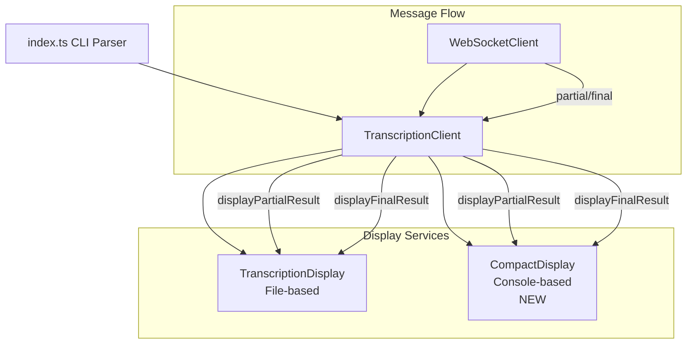
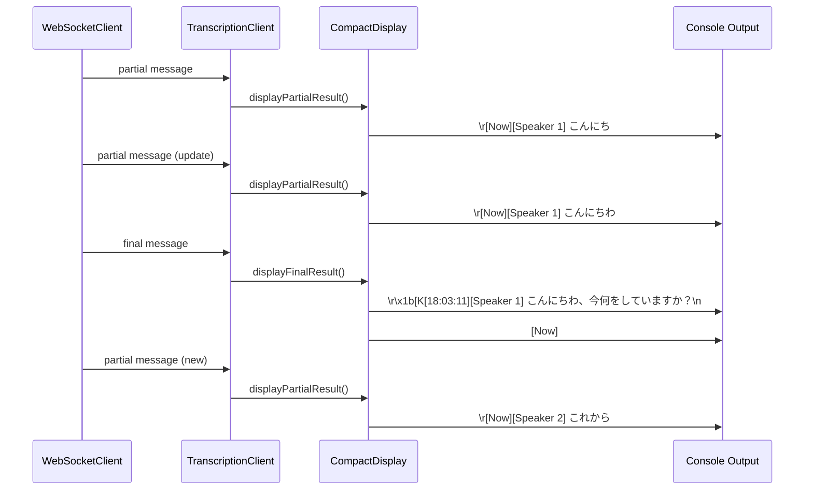
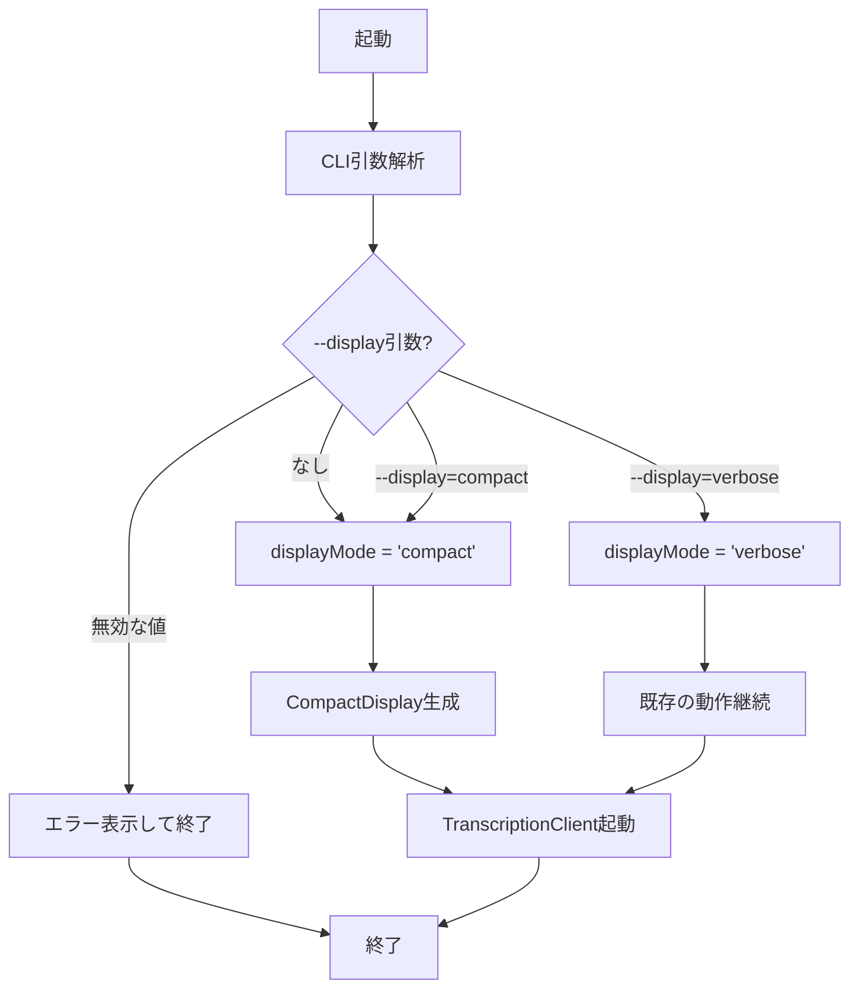

# Technical Design Document

## Overview

WebSocketクライアントに新しいCompact表示モードを実装します。このモードは、リアルタイム音声文字起こしの結果をコンソール上でシンプルかつ読みやすいテキスト形式で表示します。Partialメッセージは逐次更新され、Finalメッセージは確定結果として履歴に追加されます。

**Purpose**: リアルタイム音声文字起こしの結果を、ユーザーが会話の流れを自然に追えるシンプルなテキスト形式でコンソールに表示する機能を提供します。

**Users**: 開発者および音声文字起こしシステムのユーザーが、デバッグ用の詳細なJSON形式（verboseモード）と、実用的なテキスト表示（compactモード）を用途に応じて選択できます。

**Impact**: 既存のファイルベース表示（TranscriptionDisplay）を維持しつつ、新しいコンソールベースのCompact表示サービスを追加します。デフォルトの表示モードがverboseからcompactに変更されます。

### Goals

- Compact表示モードをデフォルト動作として実装
- Partialメッセージを `[Now][Speaker X] text` 形式で逐次更新表示
- Finalメッセージを `[HH:MM:SS][Speaker X] text` 形式で確定表示
- `--display=verbose` オプションで既存のJSON形式表示に切り替え可能
- 既存のTranscriptionDisplayサービスとの共存

### Non-Goals

- ファイル出力機能の変更（既存のTranscriptionDisplayはそのまま維持）
- WebSocketメッセージフォーマットの変更
- リッチなターミナルUI（色付け、ボックス描画など）の実装

## Architecture

### 既存アーキテクチャの分析

WebSocketクライアントは以下の階層構造を持つイベント駆動型アーキテクチャです：

**現在の主要コンポーネント** (websocket-client/src/):
- `index.ts`: エントリーポイント、CLI引数解析、サービス初期化
- `services/TranscriptionClient.ts`: WebSocketメッセージ受信とイベント処理の中核
- `services/TranscriptionDisplay.ts`: ファイルベースの表示サービス（live.txt、日次ログ）
- `services/WebSocketClient.ts`: WebSocket接続管理
- `services/AudioCaptureService.ts`: 音声キャプチャ
- `services/VoiceActivityDetector.ts`: 音声検出

**現在の表示フロー**:
1. WebSocketClient → TranscriptionClient（メッセージ受信）
2. TranscriptionClient → TranscriptionDisplay（displayPartialResult/displayFinalResult呼び出し）
3. TranscriptionDisplay → ファイル書き込み（live.txt、YYYY-MM-DD.log）

**既存のドメイン境界**:
- WebSocket通信層（WebSocketClient）
- 音声処理層（AudioCaptureService, VoiceActivityDetector）
- 文字起こし処理層（TranscriptionClient）
- 表示層（TranscriptionDisplay）

**既存の技術的制約**:
- CLI引数は手動パーサー（switch/case）で処理
- 設定の優先順位: CLI引数 → 環境変数 → デフォルト値
- メッセージ型はJSON形式でtypeフィールドで識別（partial/final）

### High-Level Architecture



### アーキテクチャ統合

**既存パターンの保持**:
- イベント駆動型アーキテクチャを維持
- サービス層の責任分離を維持
- TranscriptionClientが表示サービスを制御する構造を維持

**新規コンポーネントの追加理由**:
- CompactDisplayサービス: コンソール表示専用の責任を持つ新しい表示サービス
- DisplayMode型: 表示モード選択のための型安全な列挙型

**技術スタックとの整合性**:
- TypeScript/Node.jsの既存スタックに準拠
- 外部依存なし（標準のprocess.stdout使用）
- 既存のメッセージ型（TranscriptionMessage）を再利用

**Steeringコンプライアンス**:
- 関心の分離原則を維持（表示ロジックを独立したサービスに分離）
- 既存のClient/Serverアーキテクチャに影響なし

## System Flows

### Compact Display Message Flow



### Display Mode Selection Flow



## Requirements Traceability

| Requirement | 要件概要 | コンポーネント | インターフェース | フロー |
|-------------|---------|---------------|----------------|--------|
| 1.1 | 引数なしでCompact動作 | index.ts, CompactDisplay | CLI引数解析, DisplayMode | Display Mode Selection Flow |
| 1.2 | --display=verboseでJSON形式 | index.ts | CLI引数解析, DisplayMode | Display Mode Selection Flow |
| 1.3 | --display=compactで明示的指定 | index.ts, CompactDisplay | CLI引数解析, DisplayMode | Display Mode Selection Flow |
| 1.4 | 無効値でエラー終了 | index.ts | CLI引数解析 | Display Mode Selection Flow |
| 2.1-2.5 | Partialメッセージ逐次表示 | CompactDisplay | displayPartialResult() | Compact Display Message Flow |
| 3.1-3.5 | Finalメッセージ確定表示 | CompactDisplay | displayFinalResult() | Compact Display Message Flow |
| 4.1-4.3 | 話者情報表示 | CompactDisplay | formatSpeaker() | Compact Display Message Flow |
| 5.1-5.3 | Verboseモード互換性維持 | TranscriptionClient | 既存ロジック | 既存フロー |
| 6.1-6.4 | ターミナル表示制御 | CompactDisplay | カーソル制御メソッド | Compact Display Message Flow |

## Components and Interfaces

### Presentation Layer

#### CompactDisplay

**責任と境界**
- **Primary Responsibility**: Partialメッセージの逐次更新とFinalメッセージの確定表示をコンソールに出力する
- **Domain Boundary**: プレゼンテーション層（表示のみ、ビジネスロジックなし）
- **Data Ownership**: 表示状態の管理（現在のPartial行の有無）
- **Transaction Boundary**: なし（ステートレス表示）

**依存関係**
- **Inbound**: TranscriptionClient（displayPartialResult/displayFinalResult呼び出し元）
- **Outbound**: process.stdout（Node.js標準出力）
- **External**: なし

**Service Interface**

```typescript
interface ITranscriptionDisplay {
  displayPartialResult(message: TranscriptionMessage): void;
  displayFinalResult(message: TranscriptionMessage): void;
}

class CompactDisplay implements ITranscriptionDisplay {
  private hasPartialLine: boolean;

  constructor();

  displayPartialResult(message: TranscriptionMessage): void;
  displayFinalResult(message: TranscriptionMessage): void;

  private formatSpeaker(speaker: number | null): string;
  private formatTimestamp(): string;
  private clearCurrentLine(): void;
  private writePartial(text: string): void;
  private writeFinal(text: string): void;
}
```

**Preconditions**:
- TranscriptionMessageが有効なpartialまたはfinal型である
- process.stdoutが利用可能である

**Postconditions**:
- displayPartialResult: `[Now][Speaker X] text` がコンソールの現在行に表示される
- displayFinalResult: 現在のPartial行がクリアされ、`[HH:MM:SS][Speaker X] text` が新しい行に表示され、新しい `[Now]` 行が開始される

**Invariants**:
- Partial行は常に最後の行に存在する（hasPartialLine=true時）
- Final表示後は必ず新しいPartial行プレースホルダー `[Now]` が表示される

**State Management**:
- **State Model**: `hasPartialLine: boolean` （Partial行が現在表示中かどうか）
- **State Transitions**:
  - `false` → `true`: displayPartialResult呼び出し時
  - `true` → `false`: displayFinalResult呼び出し時（一時的）
  - `false` → `true`: displayFinalResult内で `[Now]` を表示後
- **Persistence**: メモリ内のみ（再起動時に状態はリセット）
- **Concurrency**: 単一スレッド動作（Node.jsイベントループ）

#### TranscriptionClient (Modified)

**責任と境界**
- **Primary Responsibility**: WebSocketメッセージを受信し、適切な表示サービスに処理を委譲する（既存機能）
- **Domain Boundary**: ビジネスロジック層（文字起こしメッセージの調整とルーティング）
- **Data Ownership**: メッセージの一時的な処理状態
- **Transaction Boundary**: メッセージ単位

**変更点**:
- CompactDisplayインスタンスを受け取るオプションを追加
- 既存のTranscriptionDisplay処理を維持

**Integration Strategy**:
- **Modification Approach**: 既存コードを拡張（TranscriptionDisplayと並行してCompactDisplayを呼び出し）
- **Backward Compatibility**: 既存のTranscriptionDisplay機能は完全に維持
- **Migration Path**: 段階的な移行（まずはverboseモードで既存動作を保証、その後compactをデフォルト化）

### Entry Point Layer

#### index.ts (Modified)

**責任と境界**
- **Primary Responsibility**: CLI引数の解析とサービスの初期化
- **Domain Boundary**: アプリケーション起動層
- **Data Ownership**: 起動設定

**変更点**:
- `--display` 引数のパース追加
- DisplayModeに基づくCompactDisplayインスタンス生成

**Integration Strategy**:
- **Modification Approach**: 既存のCLI引数パーサーにswitch caseを追加
- **Backward Compatibility**: 既存の引数（--server-url等）は完全に維持
- **Migration Path**: デフォルト動作の変更（なし→compact、明示的verbose指定が必要）

## Data Models

### Domain Model

**Core Concepts**:

既存のメッセージ型を再利用し、表示モード設定のための新しい型を追加します。

**Entities**:
- TranscriptionMessage: 既存の文字起こしメッセージエンティティ（partial/final型を含む）

**Value Objects**:
- DisplayMode: 表示モード選択の値オブジェクト（'compact' | 'verbose'）
- Speaker: 話者番号（number | null）

**Business Rules & Invariants**:
- DisplayModeは 'compact' または 'verbose' のみ許可
- Partialメッセージは常に最新のもので上書きされる
- Finalメッセージは履歴として永続的に表示される

### Logical Data Model

#### DisplayMode

```typescript
type DisplayMode = 'compact' | 'verbose';
```

**Purpose**: CLI引数から表示モードを型安全に表現

**Validation**:
- 'compact' または 'verbose' 以外の値は起動時エラー

#### TranscriptionMessage (既存)

```typescript
interface TranscriptionMessage {
  type: 'partial' | 'final';
  buffer_id: string;
  text: string;
  segments: Array<{
    text: string;
    start: number;
    end: number;
    speaker: number | null;
  }>;
  timestamp_range: {
    start: number;
    end: number;
  };
  latency_ms: number;
}
```

**Purpose**: WebSocketサーバーから受信する文字起こしメッセージ

**Key Attributes**:
- `type`: メッセージがpartialかfinalかを識別
- `segments[0].speaker`: 話者番号（最初のセグメントから取得）
- `text`: 表示するテキスト内容

#### Display State

```typescript
interface DisplayState {
  hasPartialLine: boolean;
}
```

**Purpose**: CompactDisplayの内部状態管理

**State Transitions**:
- Partial表示時: `hasPartialLine = true`
- Final表示時: `hasPartialLine = false` → Finalテキスト出力 → `hasPartialLine = true` ([Now]表示)

## Error Handling

### Error Strategy

CompactDisplay実装では、表示エラーは基本的に発生しないため、最小限のエラーハンドリングを実装します。CLI引数のバリデーションエラーには明確なメッセージを提供します。

### Error Categories and Responses

**User Errors (CLI引数)**:
- **Invalid --display value**:
  - Error Message: `Invalid display mode: "${value}". Valid options are: compact, verbose`
  - Response: プロセス終了（exit code 1）
  - Example: `--display=json` → エラーメッセージ表示して終了

**System Errors (Runtime)**:
- **stdout write failure** (極めて稀):
  - Response: 例外をそのまま伝播（Node.jsのデフォルトエラーハンドリング）
  - Rationale: stdoutが利用できない状態は回復不可能なため、プロセス終了が適切

**Business Logic Errors**:
- **Missing speaker information**:
  - Response: 話者部分を省略して表示継続（`[Now] text` または `[HH:MM:SS] text`）
  - Rationale: 話者情報は必須ではなく、テキスト表示は継続すべき

### Monitoring

- **Logging**: 既存のログ機構を使用（console.error for startup errors）
- **Health Monitoring**: 不要（ステートレスな表示サービス）
- **Error Tracking**: CLI引数エラーのみ（起動時にユーザーに表示）

## Testing Strategy

### Unit Tests

CompactDisplayサービスのユニットテスト（`CompactDisplay.test.ts`）:

1. **Partial表示のフォーマット検証**
   - `displayPartialResult()` が `[Now][Speaker X] text` 形式で出力すること
   - 話者情報がない場合は `[Now] text` 形式で出力すること
   - 空テキストの場合は `[Now]` のみ出力すること

2. **Final表示のフォーマット検証**
   - `displayFinalResult()` が `[HH:MM:SS][Speaker X] text` 形式で出力すること
   - タイムスタンプが現在時刻（HH:MM:SS形式）であること
   - 改行が含まれること

3. **カーソル制御シーケンス検証**
   - Partial更新時に `\r` が使用されること
   - Final表示時に `\r\x1b[K` が使用されること（行クリア）
   - Final表示後に `[Now]` が新しい行として表示されること

4. **State管理検証**
   - `hasPartialLine` フラグが適切に更新されること
   - Partial → Final → Partial のシーケンスで状態が正しく遷移すること

5. **話者情報抽出**
   - `segments[0].speaker` から話者番号が正しく取得されること
   - segmentsが空の場合にnullが返されること

### Integration Tests

TranscriptionClientとCompactDisplayの統合テスト（`TranscriptionClient.test.ts` 修正）:

1. **Display Mode選択**
   - compactモード時にCompactDisplayが使用されること
   - verboseモード時に既存の動作が維持されること

2. **Message Flow**
   - WebSocketからのpartialメッセージがCompactDisplayに正しく渡されること
   - WebSocketからのfinalメッセージがCompactDisplayに正しく渡されること

3. **Multiple Display Services**
   - TranscriptionDisplayとCompactDisplayの両方が同時に機能すること
   - 各サービスが独立して動作すること

### E2E Tests

CLI引数とエンドツーエンドの動作検証:

1. **CLI引数解析**
   - 引数なし起動でcompactモードが選択されること
   - `--display=compact` でcompactモードが選択されること
   - `--display=verbose` でverboseモードが選択されること
   - 無効な値でエラーメッセージが表示され終了すること

2. **Real WebSocket Message Handling**
   - 実際のWebSocketサーバーからのメッセージで正しく表示されること
   - Partial → Final のシーケンスが正しく処理されること

3. **Console Output Verification**
   - コンソール出力が期待されるフォーマットであること
   - 長いテキストが自然に折り返されること

## Technology Alignment

本機能は既存のWebSocketクライアントの技術スタックに完全に準拠します：

**既存技術との整合性**:
- TypeScript/Node.js: 既存のクライアントアプリケーションスタック
- process.stdout: Node.js標準ライブラリ（新規依存なし）
- 既存のメッセージ型（TranscriptionMessage）を再利用

**新規導入要素**:
- なし（既存のNode.js標準機能のみ使用）

**アーキテクチャパターンの踏襲**:
- イベント駆動型アーキテクチャ（既存のTranscriptionClientパターン）
- サービス指向設計（TranscriptionDisplayと同様の責任分離）
- 依存性注入（TranscriptionClientがDisplayサービスを受け取る）

## Key Design Decisions

### Decision 1: Compact Display as Default Mode

**Decision**: Compactモードをデフォルト動作とし、verboseモードは `--display=verbose` で明示的に指定する

**Context**:
- 要件で「デフォルト動作を新しいCompactモードとする」と明確に指定されている
- 既存のJSON形式表示（verbose）はデバッグ用途であり、日常的な使用には冗長

**Alternatives**:
1. verboseをデフォルトに保ち、compactを `--display=compact` で指定
2. 環境変数でデフォルトを切り替え可能にする
3. 設定ファイルでデフォルトモードを管理

**Selected Approach**: compactをデフォルトとし、verboseは明示的なオプション指定

**Rationale**:
- ユーザー体験の向上（ほとんどのユースケースでシンプルな表示が望ましい）
- 要件との完全な整合性
- 既存のverbose動作は `--display=verbose` で完全にアクセス可能

**Trade-offs**:
- Gain: より良いデフォルトUX、読みやすい出力
- Sacrifice: 既存ユーザーは明示的にverbose指定が必要（破壊的変更）

### Decision 2: Separate CompactDisplay Service

**Decision**: 新しいCompactDisplayサービスクラスを作成し、既存のTranscriptionDisplayと並行して動作させる

**Context**:
- 既存のTranscriptionDisplayはファイルベース表示を担当
- Compactモードはコンソールベース表示で、責任が異なる
- 両方の表示方式を同時にサポートする必要がある

**Alternatives**:
1. TranscriptionDisplayを拡張してcompactモードを内部で切り替え
2. TranscriptionDisplayをリファクタリングして抽象化
3. CompactDisplay機能をTranscriptionClientに直接実装

**Selected Approach**: 独立したCompactDisplayサービスクラスを新規作成

**Rationale**:
- 単一責任原則（CompactDisplay=コンソール表示、TranscriptionDisplay=ファイル表示）
- 既存コードへの影響を最小化（TranscriptionDisplayは無変更）
- テストの容易性（各サービスを独立してテスト可能）
- 将来の拡張性（新しい表示モードを追加しやすい）

**Trade-offs**:
- Gain: クリーンな責任分離、既存コードの安全性、テスト容易性
- Sacrifice: わずかなコード重複（ITranscriptionDisplayインターフェース実装）

### Decision 3: ANSI Escape Sequences for In-Place Updates

**Decision**: `\r` (Carriage Return) と `\x1b[K` (ANSI Clear Line) を使用してPartial行を逐次更新

**Context**:
- Partialメッセージは頻繁に更新される（リアルタイム音声認識の途中結果）
- スクロールなしで同じ行を更新することで、読みやすさとパフォーマンスを向上
- ターミナルはANSI escape sequencesを広くサポート

**Alternatives**:
1. 毎回新しい行に追加（スクロールが発生）
2. サードパーティライブラリ（blessed, ink）を使用してリッチなTUI実装
3. カーソル位置制御ライブラリ（ansi-escapes）を導入

**Selected Approach**: 生のANSI escape sequences（`\r\x1b[K`）を直接使用

**Rationale**:
- 外部依存ゼロ（Node.js標準機能のみ）
- シンプルな実装（2つの制御シーケンスのみ）
- ほぼ全てのモダンターミナルで動作
- パフォーマンス（ライブラリオーバーヘッドなし）

**Trade-offs**:
- Gain: ゼロ依存、シンプルさ、高パフォーマンス
- Sacrifice: 古いターミナルでの互換性（ただし現実的には問題なし）、リッチなUI機能なし（要件外）
