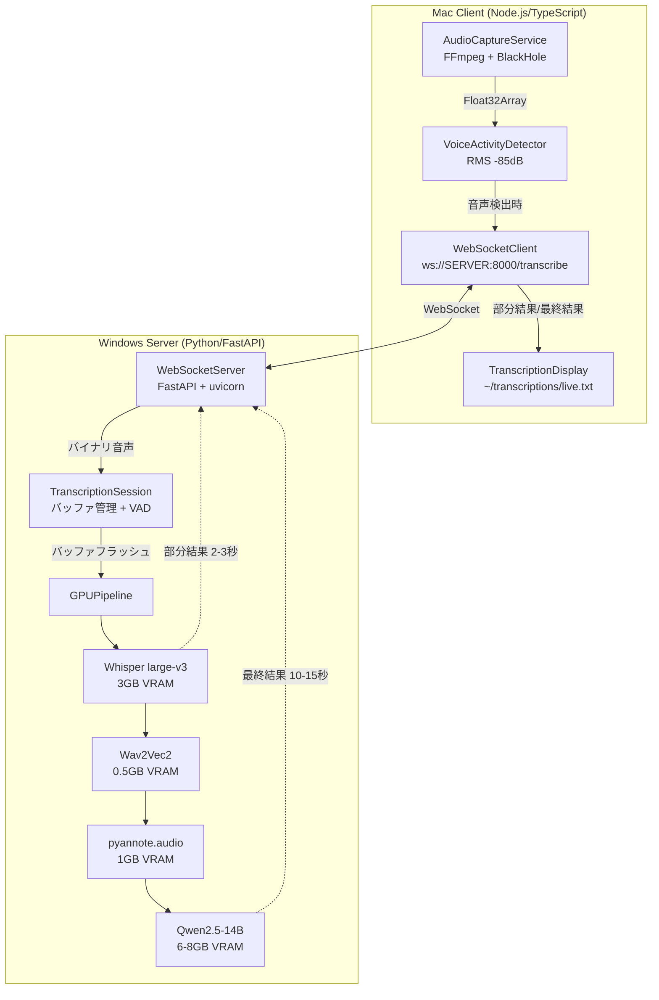
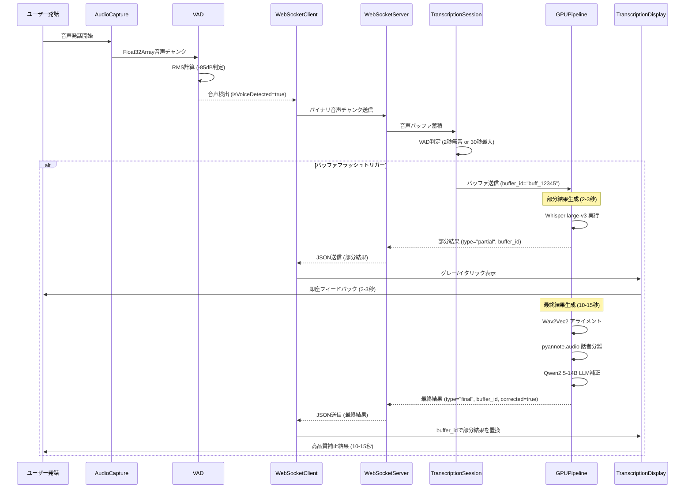
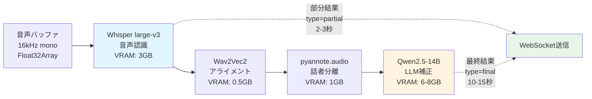
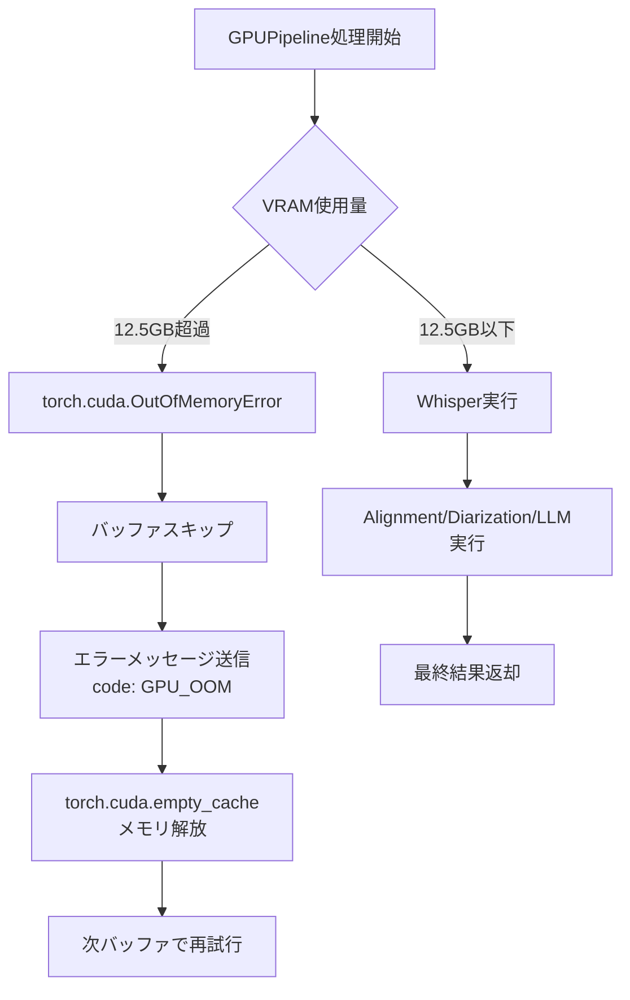
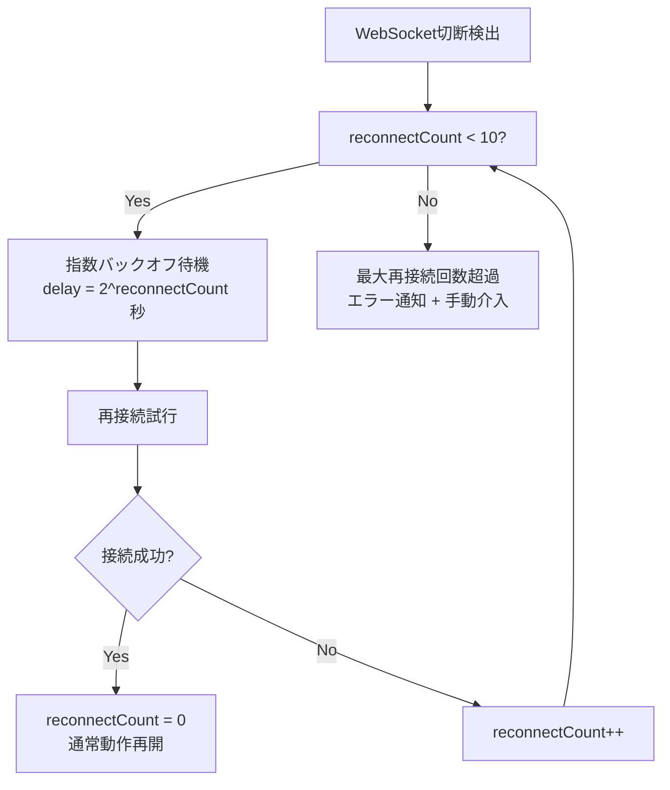

# 技術設計書: WebSocketリアルタイム音声文字起こしシステム

## 概要

本システムは、WebSocketベースのリアルタイム音声文字起こしシステムを提供します。Mac Client (Node.js/TypeScript) とWindows Server (Python/FastAPI) の2層構成で、高精度な日本語音声認識、話者分離、LLM補正を実現します。

**目的**: ユーザーに対して、発話から2-3秒以内の即座のフィードバック（部分結果）と、10-15秒以内の高品質な補正結果（最終結果）を提供する、優れたUXのリアルタイム文字起こし体験を実現します。

**ユーザー**: 会議、講演、インタビューなどの音声を継続的に記録・文字起こししたい個人・組織が対象です。ローカルネットワーク内で完結するため、プライバシーを重視するユーザーに最適です。

**影響**: 既存のHTTPベースのバッチ処理システム (continuous-audio-transcription) を、WebSocketストリーミングアーキテクチャに移行します。これにより、レイテンシが大幅に改善され、プログレッシブ表示によるユーザー体験が向上します。

### 目標

- **リアルタイム性**: 部分結果を2-3秒以内、最終結果を15秒以内に表示
- **高精度**: 音声認識95%以上、話者分離90%以上の精度
- **プログレッシブUX**: 即座のフィードバック（部分結果）と遅延補正（最終結果）による優れたユーザー体験
- **プライバシー**: 完全ローカル実行（外部API不使用）
- **安定性**: 99.9%の稼働率、自動再接続、エラーハンドリング

### 非目標

- 複数クライアントの同時接続サポート（Phase 1では1対1接続のみ）
- リアルタイムストリーミング中の話者識別（録音後の話者分離のみ）
- クラウドAPI統合（完全ローカル実行を維持）
- モバイルクライアント対応（Mac/Windowsデスクトップのみ）

## アーキテクチャ

### 既存アーキテクチャの分析

**旧アーキテクチャ (continuous-audio-transcription)** は以下の特性を持ちます:

- **通信方式**: HTTP POST ベースのバッチ処理（30秒チャンクを一括送信）
- **クライアント**: Mac Client (TypeScript/Node.js)
  - AudioCaptureService: FFmpegでBlackHoleから音声キャプチャ
  - BufferManager: 30秒バッファリング + VAD (Voice Activity Detection)
  - VoiceActivityDetector: RMSレベル分析による音声検出
  - CUDAServerClient: HTTP POST でサーバーに送信
  - Logger, ConfigService: 再利用可能な共通サービス
- **サーバー**: Windows Server (Python/FastAPI)
  - WhisperXService: Whisper音声認識
  - DiarizationService: pyannote.audio話者分離
  - HTTP POST `/transcribe` エンドポイント

**制約と課題**:
- HTTPバッチ処理のため、30秒ごとのレイテンシが発生
- サーバー側でのバッファリングなし（クライアント側のみ）
- プログレッシブ表示不可（全処理完了まで待機）
- LLM補正パイプラインなし

**新アーキテクチャへの移行方針**:
- **再利用**: AudioCaptureService, VoiceActivityDetector, BufferManager, Logger, ConfigServiceは最小限の修正で再利用
- **置き換え**: CUDAServerClient (HTTP) → WebSocketClient (WebSocket)
- **新規追加**: サーバー側WebSocketエンドポイント, TranscriptionSession, LLM補正パイプライン, プログレッシブ表示

### ハイレベルアーキテクチャ



**アーキテクチャ統合の詳細**:

- **既存パターンの維持**:
  - クライアント側: サービス指向アーキテクチャ（AudioCaptureService, BufferManager等のサービス分離）
  - サーバー側: FastAPI + ルーター構造
  - 設定管理: ConfigService + YAML設定ファイル
  - ロギング: Logger抽象化による一貫したログ出力

- **新規コンポーネントの追加根拠**:
  - **WebSocketClient**: HTTP POSTからWebSocketへの通信プロトコル変更に対応
  - **TranscriptionSession**: サーバー側でのストリーム管理、VADトリガー、バッファ管理が必要
  - **GPUPipeline**: Whisper → Alignment → Diarization → LLMの4段階処理を統合管理
  - **TranscriptionDisplay**: プログレッシブ表示（部分/最終結果の差分更新）の実現

- **技術スタック適合性**:
  - Mac Client: Node.js 18+, TypeScript, FFmpeg（既存と同一）
  - Windows Server: Python 3.10+, FastAPI, CUDA 11.8+（既存と同一）
  - 新規追加: Ollama (Qwen2.5-14B実行環境), WebSocket (ws/uvicorn)

- **Steering原則への準拠**:
  - **tech.md**: PyTorch 2.5.1+cu121, transformers 4.44.2, Git Bash環境での`/`パス区切り
  - **product.md**: 完全ローカル実行、プライバシー保護、コスト削減
  - **structure.md**: サービス指向設計、レイヤー分離、テスト可能性

### 技術スタックと設計決定

#### クライアント層 (Mac)

| カテゴリ | 選定技術 | 根拠 | 代替案 |
|---------|---------|------|--------|
| ランタイム | Node.js 18+ | 既存実装との互換性、FFmpeg統合容易性 | Deno（エコシステム未成熟） |
| 言語 | TypeScript | 型安全性、既存コードベースとの一貫性 | JavaScript（型安全性なし） |
| WebSocket | ws (npm) | 軽量、成熟したライブラリ、自動再接続実装容易 | Socket.io（過剰機能） |
| 音声キャプチャ | FFmpeg + BlackHole | 既存実装で実績あり、安定性高い | PortAudio（C/C++バインディング複雑） |

#### サーバー層 (Windows)

| カテゴリ | 選定技術 | 根拠 | 代替案 |
|---------|---------|------|--------|
| Webフレームワーク | FastAPI + uvicorn | WebSocket対応、既存実装との一貫性、高速 | Flask（WebSocket対応弱い）, Django（重量級） |
| 音声認識 | Whisper large-v3 | 日本語精度最高クラス、3GB VRAMで実行可能 | Whisper medium（精度低下） |
| アライメント | Wav2Vec2 | WhisperX標準、0.5GB VRAM、高精度 | Montreal Forced Aligner（セットアップ複雑） |
| 話者分離 | pyannote.audio | オープンソース最高精度、1GB VRAM | resemblyzer（精度低い） |
| LLM補正 | Qwen2.5-14B-Instruct | 日本語文脈理解優秀、6-8GB VRAM、Ollama対応 | GPT-4（外部API、コスト高） |
| CUDA | PyTorch 2.5.1+cu121 | steering/tech.md準拠、WhisperX互換性 | PyTorch 2.6+（CUDA 12.1版未提供） |

#### 主要設計決定

##### 決定1: プログレッシブ表示（部分結果 → 最終結果）

**決定**: 2段階表示システム（部分結果: Whisperのみ、最終結果: 全パイプライン）を採用

**文脈**: GPUパイプライン全体（Whisper → Alignment → Diarization → LLM）の処理には10-15秒かかり、ユーザーがシステムの動作を認識できないまま待機することになります。

**代替案**:
1. **全処理完了後に表示**: レイテンシ15秒、UX悪い
2. **Whisper結果のみ即座表示**: レイテンシ2-3秒、補正なし
3. **段階的表示（選択）**: 部分2-3秒 → 最終10-15秒、最良UX

**選択アプローチ**:
- **部分結果**: Whisper音声認識のみ実行（2-3秒）、グレー/イタリック体で暫定表示
- **最終結果**: Whisper → Alignment → Diarization → LLM実行（10-15秒）、buffer_idで部分結果を完全置換

**根拠**:
- ユーザーは2-3秒で即座のフィードバックを得られ、システムが動作していることを認識
- LLM補正による高品質な結果も10-15秒以内に提供
- buffer_idによる明確なマッチング（タイムスタンプマッチングの曖昧性を回避）

**トレードオフ**:
- 利点: 優れたUX、システム応答性の向上、段階的情報提供
- 欠点: クライアント側で部分/最終結果の管理が必要、実装複雑性増加

##### 決定2: 相対タイムスタンプ（バッファ開始時刻基準）

**決定**: 絶対時刻ではなく、バッファ開始時刻からの相対時間をタイムスタンプとして使用

**文脈**: クライアントとサーバーの時刻が同期していない場合、タイムスタンプベースのマッチングが失敗します。NTPによる時刻同期は追加の複雑性とインフラ要求を伴います。

**代替案**:
1. **絶対時刻 + NTP同期**: 複雑性高い、インフラ依存
2. **タイムスタンプなし**: セグメント順序のみ（柔軟性低い）
3. **相対時刻（選択）**: シンプル、同期不要、バッファ単位で一貫

**選択アプローチ**:
```python
# サーバー側
buffer_start_time = time.time()  # バッファ受信開始時刻を記録
segments = [
    {"start": 0.12, "end": 1.85, "text": "..."},  # バッファ開始からの相対時間
]
```

**根拠**:
- クライアント/サーバー間の時刻同期が不要
- バッファ単位で完結する明確なタイムスタンプ管理
- シンプルな実装、依存関係なし

**トレードオフ**:
- 利点: 時刻同期不要、実装シンプル、障害点削減
- 欠点: バッファをまたぐタイムスタンプ連続性なし（要件上問題なし）

##### 決定3: buffer_idによる部分/最終結果マッチング

**決定**: buffer_idを使用して部分結果と最終結果を紐付け、時間範囲全体を置換

**文脈**: 部分結果と最終結果のマッチング方法として、タイムスタンプ、テキスト類似度、buffer_idの3つの選択肢があります。

**代替案**:
1. **タイムスタンプマッチング**: ±0.1s許容誤差、曖昧性あり
2. **テキスト類似度**: Levenshtein距離、計算コスト高い、不確実
3. **buffer_id（選択）**: 明確、確実、シンプル

**選択アプローチ**:
```typescript
// クライアント側
partialBuffers.set(result.buffer_id, {
  timestamp_range: { start: 0, end: 30 },
  segments: [...]
});

// 最終結果到着時
const partial = partialBuffers.get(result.buffer_id);
replaceTimeRange(partial.timestamp_range.start, partial.timestamp_range.end, finalSegments);
```

**根拠**:
- バッファ単位での明確な識別子
- 曖昧性なし（タイムスタンプマッチングの±誤差問題を回避）
- シンプルな実装（テキスト類似度計算不要）

**トレードオフ**:
- 利点: 確実性、シンプル、高速
- 欠点: バッファIDの管理が必要（最小限のオーバーヘッド）

## システムフロー

### シーケンス図: プログレッシブ表示フロー



### データフロー図: GPU処理パイプライン



## 要件トレーサビリティ

| 要件ID | 要件概要 | 実現コンポーネント | インターフェース | フロー図 |
|--------|---------|------------------|---------------|---------|
| R1.1 | WebSocket双方向通信 | WebSocketClient, WebSocketServer | ws://SERVER:8000/transcribe | シーケンス図 |
| R1.2 | 自動再接続 | WebSocketClient | reconnect(), exponentialBackoff() | - |
| R2.1 | 音声キャプチャ | AudioCaptureService | FFmpeg spawn, BlackHole | - |
| R2.2 | VAD (-85dB) | VoiceActivityDetector | analyze(buffer): VADResult | - |
| R3.1 | 部分結果表示 (2-3秒) | GPUPipeline (Whisperのみ) | {type: "partial", buffer_id, segments} | シーケンス図 |
| R3.2 | 最終結果表示 (10-15秒) | GPUPipeline (全段階) | {type: "final", buffer_id, segments, corrected} | シーケンス図 |
| R3.3 | 相対タイムスタンプ | TranscriptionSession | buffer_start_time, segments[].start/end | - |
| R4.1-4.4 | GPU処理パイプライン | GPUPipeline | Whisper → Wav2Vec2 → pyannote → Qwen2.5 | データフロー図 |
| R5.1-5.3 | WebSocketプロトコル | WebSocketServer, WebSocketClient | JSON messages (partial/final/error) | シーケンス図 |
| R6.1-6.2 | 表示とログ記録 | TranscriptionDisplay | ~/transcriptions/live.txt, logs/*.log | - |
| R7.1-7.3 | エラーハンドリング | WebSocketServer, WebSocketClient | try/catch, reconnect, logging | - |
| R8.1-8.4 | パフォーマンス要件 | 全コンポーネント | レイテンシ、精度、リソース監視 | - |
| R9.1-9.2 | セキュリティ | 全コンポーネント | ローカル実行、データ削除ポリシー | - |

## コンポーネントと設計

### Mac Client層

#### AudioCaptureService

**責任と境界**
- **主要責任**: BlackHole仮想オーディオデバイスからFFmpegでリアルタイム音声ストリームをキャプチャ
- **ドメイン境界**: 音声入力レイヤー（オーディオハードウェア抽象化）
- **データ所有**: 生音声バッファ（Float32Array）、キャプチャ統計
- **トランザクション境界**: 単一FFmpegプロセスのライフサイクル管理

**依存関係**
- **インバウンド**: main.ts（起動/停止）、WebSocketClient（音声データ要求）
- **アウトバウンド**: BufferManager（音声チャンク転送）、FFmpeg（プロセス起動）
- **外部**: FFmpeg（システムインストール）、BlackHole 2ch

**外部依存調査**:
- **FFmpeg**: 音声キャプチャに必須、`-f avfoundation -i :BlackHole2ch`でmacOS音声デバイスアクセス
- **BlackHole**: 仮想オーディオデバイス、システム音声をループバック
- **インストール確認**: `ffmpeg -version`, `ffmpeg -f avfoundation -list_devices true`

**契約定義**

**サービスインターフェース**:
```typescript
interface AudioCaptureService {
  start(): Promise<void>;
  stop(): Promise<void>;
  getStatistics(): AudioStatistics;
}

interface AudioStatistics {
  bytesCapture: number;
  uptime: number;
  restartCount: number;
  lastRestartTime?: Date;
}
```

- **事前条件**: FFmpegがPATHに存在、BlackHole 2chがインストール済み
- **事後条件**: start()後、BufferManagerに音声チャンクがストリーミングされる
- **不変条件**: FFmpegプロセスが停止した場合、自動再起動（最大3回）

**状態管理**:
- **状態モデル**: STOPPED → STARTING → RUNNING → STOPPING → STOPPED
- **永続化**: なし（メモリ内状態のみ）
- **同時実行制御**: 単一FFmpegプロセス、ロックなし

**統合戦略**:
- **修正アプローチ**: 既存実装を最小限修正（WebSocketClientへの連携のみ変更）
- **後方互換性**: HTTP POSTクライアントとの共存可能
- **移行パス**: BufferManagerのflush()イベントをWebSocketClient.send()に接続

#### VoiceActivityDetector

**責任と境界**
- **主要責任**: 音声バッファのRMSレベル分析による音声/無音判定（-85dB閾値）
- **ドメイン境界**: 信号処理レイヤー（音声特徴抽出）
- **データ所有**: VAD統計（音声/無音時間）、現在の無音継続時間
- **トランザクション境界**: analyze()呼び出し単位

**依存関係**
- **インバウンド**: BufferManager（音声チャンク分析要求）
- **アウトバウンド**: なし（純粋関数）
- **外部**: なし

**契約定義**

**サービスインターフェース**:
```typescript
interface VoiceActivityDetector {
  analyze(buffer: Buffer): VADResult;
  getConfig(): VADConfig;
  getStatistics(): VADStatistics;
  reset(): void;
}

interface VADResult {
  isVoiceDetected: boolean;
  averageLevel: number; // dB
  silenceDuration: number; // seconds
}

interface VADConfig {
  sampleRate: number;
  channels: number;
  silenceThreshold: number; // -85 dB
  silenceDuration: number; // 10 seconds
  forceVoiceAfter: number; // 300 seconds (5分後強制音声判定)
}
```

- **事前条件**: bufferが有効なFloat32Array
- **事後条件**: RMSレベル > -85dB → isVoiceDetected=true
- **不変条件**: silenceDuration >= 0

**状態管理**:
- **状態モデル**: ステートレス（analyze()単位）、統計のみ累積
- **永続化**: なし
- **同時実行制御**: なし（単一スレッド想定）

**統合戦略**:
- **修正アプローチ**: 既存実装をそのまま再利用（変更不要）
- **後方互換性**: 完全互換
- **移行パス**: BufferManagerから引き続き使用

#### WebSocketClient

**責任と境界**
- **主要責任**: Windows ServerへのWebSocket接続確立、音声送信、結果受信、自動再接続
- **ドメイン境界**: 通信レイヤー（ネットワークI/O）
- **データ所有**: WebSocket接続状態、再接続カウント、送信キュー
- **トランザクション境界**: WebSocketメッセージ送受信単位

**依存関係**
- **インバウンド**: main.ts（接続管理）、AudioCaptureService（音声送信）
- **アウトバウンド**: TranscriptionDisplay（結果転送）
- **外部**: ws (npm)

**外部依存調査**:
- **ws (npm)**: Node.js標準WebSocketライブラリ
- **API**: `new WebSocket(url)`, `ws.send(data)`, `ws.on('message', handler)`
- **再接続**: 手動実装（指数バックオフ: 1s, 2s, 4s, 8s, 16s, 最大10回）

**契約定義**

**サービスインターフェース**:
```typescript
interface WebSocketClient {
  connect(url: string): Promise<void>;
  disconnect(): Promise<void>;
  sendAudioChunk(chunk: Buffer): Promise<void>;
  on(event: 'partial' | 'final' | 'error', handler: (data: TranscriptionResult) => void): void;
}

interface TranscriptionResult {
  type: 'partial' | 'final' | 'error';
  buffer_id: string;
  timestamp_range?: { start: number; end: number };
  segments?: Segment[];
  code?: string; // エラーコード
  message?: string; // エラーメッセージ
}

interface Segment {
  start: number; // 相対時刻（秒）
  end: number;
  text: string;
  speaker?: string; // Speaker_00, Speaker_01, etc.
  corrected?: boolean; // LLM補正済みフラグ
}
```

- **事前条件**: サーバーがws://SERVER:8000/transcribeでリッスン中
- **事後条件**: connect()後、sendAudioChunk()でバイナリ送信可能
- **不変条件**: 再接続中もsendAudioChunk()はキューイング（送信順序保証）

**状態管理**:
- **状態モデル**: DISCONNECTED → CONNECTING → CONNECTED → DISCONNECTED
- **永続化**: なし
- **同時実行制御**: 単一WebSocket接続、送信キューで順序保証

**統合戦略**:
- **修正アプローチ**: 新規実装（CUDAServerClient HTTPを置換）
- **後方互換性**: CUDAServerClientと並行実装可能（切り替え可能）
- **移行パス**: BufferManager.flush()イベントをWebSocketClient.sendAudioChunk()に接続

#### TranscriptionDisplay

**責任と境界**
- **主要責任**: 部分結果/最終結果の差分表示、live.txtへのリアルタイム書き込み、ログファイル記録
- **ドメイン境界**: プレゼンテーションレイヤー（ユーザー可視化）
- **データ所有**: 表示中の文字起こしバッファ、buffer_idマップ
- **トランザクション境界**: 結果受信単位

**依存関係**
- **インバウンド**: WebSocketClient（結果受信）
- **アウトバウンド**: FileSystem（ファイル書き込み）
- **外部**: fs (Node.js標準)

**契約定義**

**サービスインターフェース**:
```typescript
interface TranscriptionDisplay {
  displayPartial(result: TranscriptionResult): void;
  displayFinal(result: TranscriptionResult): void;
  saveTo(path: string): Promise<void>;
}
```

- **事前条件**: ~/transcriptions/ディレクトリが書き込み可能
- **事後条件**: displayPartial()でグレー/イタリック、displayFinal()で通常フォント表示
- **不変条件**: buffer_idでpartial/final結果が1:1対応

**状態管理**:
- **状態モデル**: partialBuffers: Map<buffer_id, PartialResult>
- **永続化**: ~/transcriptions/live.txt（リアルタイム）、~/transcriptions/logs/YYYY-MM-DD.log（日次）
- **同時実行制御**: なし（単一スレッド想定）

**統合戦略**:
- **修正アプローチ**: 新規実装（TranscriptionWriterを拡張）
- **後方互換性**: TranscriptionWriterと並行実装可能
- **移行パス**: WebSocketClient.on('partial'/'final')イベントハンドラ登録

### Windows Server層

#### WebSocketServer

**責任と境界**
- **主要責任**: FastAPIベースのWebSocketエンドポイント提供、接続管理、エラーハンドリング
- **ドメイン境界**: 通信レイヤー（ネットワークI/O）
- **データ所有**: アクティブWebSocket接続、セッションID
- **トランザクション境界**: WebSocketメッセージ送受信単位

**依存関係**
- **インバウンド**: Mac Client WebSocketClient
- **アウトバウンド**: TranscriptionSession（音声データ転送）
- **外部**: FastAPI, uvicorn

**外部依存調査**:
- **FastAPI**: Python Webフレームワーク、WebSocket対応
- **uvicorn**: ASGI サーバー、WebSocketサポート
- **API**: `@app.websocket("/transcribe")`, `await websocket.accept()`, `await websocket.send_json()`
- **公式ドキュメント**: https://fastapi.tiangolo.com/advanced/websockets/

**契約定義**

**APIコントラクト**:

| メソッド | エンドポイント | リクエスト | レスポンス | エラー |
|---------|--------------|----------|----------|--------|
| WebSocket | ws://SERVER:8000/transcribe | バイナリ音声チャンク | JSON (partial/final/error) | 400, 500, 503 |

**WebSocketメッセージ仕様**:

**クライアント → サーバー**:
```
バイナリフレーム: Float32Array (16kHz, mono, 32-bit float)
```

**サーバー → クライアント (部分結果)**:
```json
{
  "type": "partial",
  "buffer_id": "buff_20251105_123456_001",
  "timestamp_range": {"start": 0, "end": 30},
  "segments": [
    {"start": 0.12, "end": 1.85, "text": "きょうはきかいについて", "speaker": "Speaker_00"}
  ]
}
```

**サーバー → クライアント (最終結果)**:
```json
{
  "type": "final",
  "buffer_id": "buff_20251105_123456_001",
  "timestamp_range": {"start": 0, "end": 30},
  "segments": [
    {"start": 0.12, "end": 1.85, "text": "今日は機械について", "speaker": "Speaker_00", "corrected": true}
  ]
}
```

**サーバー → クライアント (エラー)**:
```json
{
  "type": "error",
  "code": "GPU_OOM",
  "message": "CUDA out of memory",
  "timestamp": "2025-11-05T12:34:56Z"
}
```

- **事前条件**: クライアントがWebSocket接続を確立
- **事後条件**: 音声チャンク受信後、TranscriptionSessionに転送
- **不変条件**: 1接続1セッション（Phase 1）

**統合戦略**:
- **修正アプローチ**: 新規実装（既存transcribe.py HTTP POSTと並行）
- **後方互換性**: HTTP POST `/transcribe`を維持可能
- **移行パス**: 新規ルーター`websocket_transcribe.py`を追加、main.pyで登録

#### TranscriptionSession

**責任と境界**
- **主要責任**: WebSocket接続単位での音声バッファ管理、VADトリガー判定、GPUPipelineへのバッファ送信
- **ドメイン境界**: セッション管理レイヤー（状態管理）
- **データ所有**: 音声バッファ、buffer_id、VAD状態
- **トランザクション境界**: バッファフラッシュ単位（2秒無音 or 30秒最大）

**依存関係**
- **インバウンド**: WebSocketServer（音声チャンク受信）
- **アウトバウンド**: GPUPipeline（バッファ送信）
- **外部**: なし

**契約定義**

**サービスインターフェース**:
```python
class TranscriptionSession:
    def add_audio_chunk(self, chunk: bytes) -> None:
        """音声チャンクをバッファに追加"""

    def should_flush(self) -> bool:
        """VADトリガー判定: 2秒無音 or 30秒最大"""

    async def flush(self) -> str:
        """バッファをGPUPipelineに送信、buffer_idを返す"""

    def get_buffer_id(self) -> str:
        """現在のbuffer_idを取得"""
```

- **事前条件**: WebSocket接続がアクティブ
- **事後条件**: flush()後、バッファはクリア、新規buffer_id生成
- **不変条件**: バッファサイズ <= 30秒 * 16kHz * 1ch * 4byte (1.92MB)

**状態管理**:
- **状態モデル**: IDLE → BUFFERING → FLUSHING → IDLE
- **永続化**: なし（メモリ内バッファのみ）
- **同時実行制御**: asyncio.Lock（flush中は新規チャンク受信ブロック）

**統合戦略**:
- **修正アプローチ**: 新規実装（サーバー側バッファリング機能追加）
- **後方互換性**: N/A（新規コンポーネント）
- **移行パス**: WebSocketServer内で`session = TranscriptionSession()`初期化

#### GPUPipeline

**責任と境界**
- **主要責任**: Whisper → Wav2Vec2 → pyannote.audio → Qwen2.5-14Bの4段階GPU処理実行、部分/最終結果生成
- **ドメイン境界**: ML/AI処理レイヤー（CUDA演算）
- **データ所有**: 読み込み済みモデル（シングルトン）、処理中バッファ
- **トランザクション境界**: バッファ処理単位

**依存関係**
- **インバウンド**: TranscriptionSession（バッファ受信）
- **アウトバウンド**: WebSocketServer（結果送信）
- **外部**: Whisper large-v3, Wav2Vec2, pyannote.audio, Qwen2.5-14B-Instruct (Ollama)

**外部依存調査**:

**Whisper large-v3**:
- **ソース**: OpenAI Whisper (Hugging Face: openai/whisper-large-v3)
- **VRAM**: 3GB
- **API**: `whisper.load_model("large-v3")`, `model.transcribe(audio)`
- **出力**: `{"segments": [{"start": 0.0, "end": 1.5, "text": "..."}], "language": "ja"}`

**Wav2Vec2 (WhisperX統合)**:
- **ソース**: WhisperX (GitHub: m-bain/whisperX)
- **VRAM**: 0.5GB
- **API**: `whisperx.align(segments, audio, model, metadata)`
- **出力**: セグメント単位のword-levelアライメント

**pyannote.audio**:
- **ソース**: pyannote/speaker-diarization-3.1 (Hugging Face)
- **VRAM**: 1GB
- **API**: `pipeline = Pipeline.from_pretrained("pyannote/speaker-diarization-3.1")`, `pipeline(audio)`
- **認証**: Hugging Face token必要 (環境変数 `HF_TOKEN`)
- **出力**: `{start: 0.5, end: 3.2, speaker: "SPEAKER_00"}`

**Qwen2.5-14B-Instruct (Ollama)**:
- **ソース**: Qwen/Qwen2.5-14B-Instruct (Hugging Face)
- **VRAM**: 6-8GB
- **Ollama**: ローカルLLM実行環境（`ollama run qwen2.5:14b-instruct`）
- **API**: `ollama.chat(model="qwen2.5:14b-instruct", messages=[...])`
- **公式ドキュメント**: https://ollama.com/library/qwen2.5
- **プロンプト例**:
  ```
  System: あなたは日本語文字起こしの補正専門家です。音声認識結果を修正してください。
  User: きょうはきかいについてはなします
  Assistant: 今日は機械について話します
  ```

**契約定義**

**サービスインターフェース**:
```python
class GPUPipeline:
    async def process_partial(self, audio_buffer: bytes, buffer_id: str) -> PartialResult:
        """Whisperのみ実行、部分結果返却 (2-3秒)"""

    async def process_final(self, audio_buffer: bytes, buffer_id: str) -> FinalResult:
        """Whisper → Alignment → Diarization → LLM実行 (10-15秒)"""

    def load_models(self) -> None:
        """全モデルをGPUにロード（起動時1回のみ）"""
```

- **事前条件**: CUDA 11.8+、RTX 3090 (24GB VRAM)、Ollama実行中
- **事後条件**: process_partial()で部分結果、process_final()で最終結果返却
- **不変条件**: VRAM使用量 <= 12.5GB (10.5-12.5GB範囲内)

**状態管理**:
- **状態モデル**: UNLOADED → LOADING → LOADED → PROCESSING → LOADED
- **永続化**: モデルファイル（~/.cache/huggingface/, ~/.ollama/）
- **同時実行制御**: asyncio.Semaphore(max_workers=1)（Phase 1は単一処理）

**統合戦略**:
- **修正アプローチ**: 既存WhisperXService, DiarizationServiceを統合、LLM補正追加
- **後方互換性**: 既存サービスと並行実装可能
- **移行パス**: 新規`gpu_pipeline.py`作成、既存サービスをラップ

## データモデル

### ドメインモデル

#### コアコンセプト

**Aggregate: TranscriptionBuffer**
- **責任**: 音声バッファの一貫性境界
- **構成**: buffer_id, audio_data, timestamp_range, vad_status
- **不変条件**: buffer_idはセッション内で一意、audio_data <= 30秒

**Entity: Segment**
- **責任**: 文字起こしセグメント（時間範囲 + テキスト + 話者）
- **構成**: start, end, text, speaker, corrected
- **不変条件**: 0 <= start < end <= buffer duration

**Value Object: TimestampRange**
- **責任**: 相対時間範囲の不変表現
- **構成**: start (秒), end (秒)
- **不変条件**: 0 <= start < end

**Domain Event: BufferFlushed**
- **トリガー**: TranscriptionSession.flush()実行時
- **ペイロード**: buffer_id, audio_data, timestamp_range
- **購読者**: GPUPipeline

**Domain Event: PartialResultGenerated**
- **トリガー**: GPUPipeline.process_partial()完了時
- **ペイロード**: buffer_id, segments (Whisperのみ)
- **購読者**: WebSocketServer

**Domain Event: FinalResultGenerated**
- **トリガー**: GPUPipeline.process_final()完了時
- **ペイロード**: buffer_id, segments (LLM補正済み)
- **購読者**: WebSocketServer

#### ビジネスルールと不変条件

- **BR-1**: buffer_idは`buff_YYYYMMDD_HHMMSS_NNN`形式（タイムスタンプ + 連番）
- **BR-2**: 部分結果と最終結果は同一buffer_idで紐付く
- **BR-3**: 最終結果のsegments[].corrected=trueはLLM補正済みを示す
- **BR-4**: speaker値は"Speaker_00", "Speaker_01"形式（pyannote出力準拠）
- **BR-5**: 相対タイムスタンプは0秒起点（バッファ開始時刻基準）

### 物理データモデル

#### メモリストア (クライアント側)

**partialBuffers: Map<buffer_id, PartialResult>**
```typescript
{
  "buff_20251105_123456_001": {
    type: "partial",
    timestamp_range: { start: 0, end: 30 },
    segments: [
      { start: 0.12, end: 1.85, text: "きょうはきかいについて", speaker: "Speaker_00" }
    ]
  }
}
```

- **キー設計**: buffer_id (String)
- **TTL**: 最終結果到着後削除（メモリリーク防止）
- **サイズ推定**: 1エントリ約1KB、最大100エントリ（~100KB）

#### ファイルストア (クライアント側)

**~/transcriptions/live.txt**
```
12:34 [Speaker_00] きょうはきかいについて (グレー/イタリック)
↓ 10秒後
12:34 [Speaker_00] 今日は機械について (通常フォント)
```

- **書き込み戦略**: 部分結果は追記、最終結果は該当行を上書き
- **ローテーション**: なし（リアルタイム表示用）

**~/transcriptions/logs/2025-11-05.log**
```
12:34 [Speaker_00] 今日は機械について話します。
12:36 [Speaker_01] それは興味深いですね。
```

- **書き込み戦略**: 最終結果のみ記録（部分結果は記録しない）
- **ローテーション**: 日次（YYYY-MM-DD.log）

#### メモリストア (サーバー側)

**session_buffers: Dict[session_id, AudioBuffer]**
```python
{
  "session_abc123": {
    "buffer_id": "buff_20251105_123456_001",
    "audio_data": bytes(...),  # 最大30秒分
    "buffer_start_time": 1699200896.123,
    "vad_silence_duration": 1.5
  }
}
```

- **キー設計**: session_id (UUID)
- **TTL**: セッション切断時削除
- **サイズ推定**: 30秒 * 16kHz * 1ch * 4byte = 1.92MB/セッション (従来比83%削減)

**model_cache: Dict[model_name, Model]**
```python
{
  "whisper-large-v3": <WhisperModel>,
  "wav2vec2": <Wav2Vec2Model>,
  "pyannote": <DiarizationPipeline>,
  "qwen2.5-14b": <OllamaClient>
}
```

- **キー設計**: model_name (String)
- **TTL**: プロセス起動中は永続（シングルトン）
- **サイズ推定**: 10.5-12.5GB VRAM

### データ契約と統合

#### WebSocketメッセージスキーマ

**部分結果スキーマ (TypeScript)**:
```typescript
interface PartialResult {
  type: 'partial';
  buffer_id: string;  // "buff_YYYYMMDD_HHMMSS_NNN"
  timestamp_range: { start: number; end: number };  // 相対時刻（秒）
  segments: Segment[];
}

interface Segment {
  start: number;  // 相対時刻（秒）
  end: number;
  text: string;
  speaker?: string;  // "Speaker_00", "Speaker_01", etc.
  corrected?: boolean;  // 常にfalse（部分結果）
}
```

**最終結果スキーマ (TypeScript)**:
```typescript
interface FinalResult {
  type: 'final';
  buffer_id: string;
  timestamp_range: { start: number; end: number };
  segments: Segment[];  // corrected=trueを含む
}
```

**エラースキーマ (TypeScript)**:
```typescript
interface ErrorResult {
  type: 'error';
  code: 'GPU_OOM' | 'MODEL_LOAD_FAILED' | 'UNKNOWN';
  message: string;
  timestamp: string;  // ISO 8601
}
```

#### スキーマバージョニング戦略

- **Phase 1**: バージョンフィールドなし（単一バージョン）
- **Phase 2以降**: `version: "1.0"`フィールド追加、後方互換性維持
- **変更ポリシー**: 新フィールド追加は後方互換、既存フィールド削除は新バージョン

#### クロスサービスデータ管理

**分散トランザクションパターン**: なし（単一バッファ単位の独立処理）

**データ同期戦略**:
- buffer_idによる結果マッチング（最終一貫性）
- 部分結果と最終結果は独立して送信（順序保証なし、buffer_idで紐付け）

**最終一貫性ハンドリング**:
- クライアント側: partialBuffers Map で部分結果を保持、最終結果到着時に削除
- タイムアウト: 部分結果から60秒経過後も最終結果未到着の場合、警告ログ（UI表示は維持）

## エラーハンドリング

### エラー戦略

Wernickeシステムは、**Graceful Degradation（段階的縮退）** 戦略を採用します。部分的な障害が発生しても、システム全体を停止せず、可能な範囲でサービスを継続します。

**基本原則**:
1. **クライアント側**: 音声キャプチャは継続、サーバー障害時は自動再接続
2. **サーバー側**: GPU OOM等の一時的エラーは該当バッファをスキップ、次バッファで復旧
3. **ユーザー通知**: エラーはログ記録 + UI通知（非侵入的）

### エラーカテゴリと対応

#### ユーザーエラー (4xx相当)

| エラー | 原因 | 対応 |
|-------|------|------|
| 不正な音声形式 | 16kHz mono以外のフォーマット送信 | WebSocketサーバーで検証、エラーメッセージ返却 |
| 認証失敗 | (Phase 2) 認証トークン不正 | 401 Unauthorized、再認証ガイダンス |
| 接続拒否 | サーバー最大接続数超過 | 503 Service Unavailable、待機または再試行ガイダンス |

**対応フロー**:
```mermaid
graph TD
    A[音声チャンク受信] --> B{形式検証}
    B -->|不正| C[エラーメッセージ送信<br/>code: INVALID_FORMAT]
    B -->|正常| D[TranscriptionSessionに転送]
    C --> E[クライアント: エラーログ記録<br/>UI通知 (非侵入的)]
```

#### システムエラー (5xx相当)

| エラー | 原因 | 対応 | 復旧戦略 |
|-------|------|------|---------|
| GPU OOM | VRAM不足（12.5GB超過） | 該当バッファスキップ、エラー通知 | 次バッファで再試行（メモリ解放後） |
| モデル読み込み失敗 | Whisper/pyannote/Qwenロード失敗 | サーバー起動失敗、ログ出力 | 手動再起動（設定確認必要） |
| Ollama接続失敗 | Qwen2.5-14B実行環境未起動 | LLM補正スキップ、部分結果のみ返却 | Ollama起動後、自動復旧 |
| WebSocket切断 | ネットワーク障害、サーバークラッシュ | 自動再接続（指数バックオフ） | 1s, 2s, 4s, 8s, 16s間隔で最大10回 |
| FFmpegクラッシュ | BlackHole切断、OSリソース枯渇 | 自動再起動（最大3回） | 3回失敗後、エラー通知 + 手動介入 |

**GPU OOMフロー**:


**WebSocket自動再接続フロー**:


#### ビジネスロジックエラー (422相当)

| エラー | 原因 | 対応 |
|-------|------|------|
| VAD無音継続 | 300秒（5分）以上無音 | 強制音声判定、バッファフラッシュ |
| セグメントなし | Whisper認識結果が空 | 警告ログ、該当バッファスキップ |
| 話者分離失敗 | pyannote未検出 | Speaker_00に全割り当て |

### 監視

**エラー追跡**:
- **クライアント**: Winston logger、~/logs/client-YYYY-MM-DD.log
- **サーバー**: Python logging、~/logs/server-YYYY-MM-DD.log
- **レベル**: ERROR (即座対応), WARN (監視), INFO (正常動作)

**ロギング例**:
```typescript
// クライアント (TypeScript)
logger.error('WebSocket connection failed', {
  url: 'ws://192.168.1.100:8000/transcribe',
  reconnectCount: 3,
  error: error.message
});
```

```python
# サーバー (Python)
logger.error("GPU OOM during Whisper execution", extra={
    "buffer_id": "buff_20251105_123456_001",
    "vram_usage_gb": 13.2,
    "error": str(e)
})
```

**ヘルス監視**:
- **エンドポイント**: GET /health (200 OK / 503 Service Unavailable)
- **レスポンス**:
  ```json
  {
    "status": "ok",
    "timestamp": "2025-11-05T12:34:56Z",
    "gpu_vram_used_gb": 11.2,
    "active_sessions": 1
  }
  ```
- **監視頻度**: 60秒ごと（クライアント側HealthChecker）

## テスト戦略

### ユニットテスト

**Mac Client (TypeScript + Jest)**:

1. **VoiceActivityDetector.analyze()**: RMSレベル計算、-85dB閾値判定、無音継続時間累積
2. **WebSocketClient.reconnect()**: 指数バックオフ計算、最大10回制限、接続状態遷移
3. **TranscriptionDisplay.replaceTimeRange()**: buffer_idマッチング、部分/最終結果置換ロジック

**Windows Server (Python + pytest)**:

1. **TranscriptionSession.should_flush()**: VADトリガー判定（2秒無音 or 30秒最大）
2. **GPUPipeline.process_partial()**: Whisper実行、部分結果生成（モック使用）
3. **GPUPipeline.process_final()**: 4段階パイプライン、最終結果生成（モック使用）
4. **buffer_id生成**: タイムスタンプ形式検証、一意性確認
5. **相対タイムスタンプ計算**: buffer_start_time基準、segments[].start/end検証

### 統合テスト

**クライアント-サーバー統合 (TypeScript + Python)**:

1. **WebSocket接続確立**: クライアント → サーバー接続、認証、セッション生成
2. **音声チャンク送信 → 部分結果受信**: 30秒音声送信 → 2-3秒以内に部分結果、buffer_id一致確認
3. **部分結果 → 最終結果置換**: 部分結果表示 → 10-15秒後最終結果、buffer_id一致、テキスト更新確認
4. **自動再接続**: サーバー強制停止 → クライアント再接続試行、指数バックオフ検証
5. **GPU OOMハンドリング**: 大量バッファ同時送信 → GPU OOMエラー → 次バッファで復旧

**エンドツーエンド (E2E)**:

1. **24時間連続稼働**: 音声キャプチャ → 文字起こし → ログ記録、メモリリーク検証
2. **話者分離精度**: 2人会話音声 → Speaker_00/Speaker_01割り当て、切り替え精度90%以上
3. **LLM補正精度**: 同音異義語テストケース（きかい→機械/機会）、フィラー削除検証

### テストケース例

**UT: VoiceActivityDetector.analyze()**
```typescript
describe('VoiceActivityDetector', () => {
  it('should detect voice when RMS > -85dB', () => {
    const vad = new VoiceActivityDetector({ silenceThreshold: -85, ... });
    const buffer = generateAudioBuffer(-70); // -70dB音声
    const result = vad.analyze(buffer);
    expect(result.isVoiceDetected).toBe(true);
  });

  it('should detect silence when RMS < -85dB', () => {
    const vad = new VoiceActivityDetector({ silenceThreshold: -85, ... });
    const buffer = generateAudioBuffer(-90); // -90dB無音
    const result = vad.analyze(buffer);
    expect(result.isVoiceDetected).toBe(false);
  });

  it('should force voice detection after 300 seconds silence', () => {
    const vad = new VoiceActivityDetector({ forceVoiceAfter: 300, ... });
    for (let i = 0; i < 300; i++) {
      const buffer = generateAudioBuffer(-90); // 無音
      vad.analyze(buffer);
    }
    const result = vad.analyze(generateAudioBuffer(-90));
    expect(result.isVoiceDetected).toBe(true); // 強制検出
  });
});
```

**IT: WebSocket音声送信 → 部分結果受信**
```typescript
describe('WebSocket Integration', () => {
  it('should receive partial result within 3 seconds', async () => {
    const client = new WebSocketClient();
    await client.connect('ws://localhost:8000/transcribe');

    const audioChunk = generateAudioChunk(30); // 30秒音声
    const startTime = Date.now();

    const partialPromise = new Promise((resolve) => {
      client.on('partial', (result) => resolve(result));
    });

    await client.sendAudioChunk(audioChunk);
    const partialResult = await partialPromise;

    const latency = Date.now() - startTime;
    expect(latency).toBeLessThan(3000); // 3秒以内
    expect(partialResult.type).toBe('partial');
    expect(partialResult.buffer_id).toBeDefined();
  });

  it('should replace partial with final result', async () => {
    // ... (部分結果受信後、10-15秒以内に最終結果受信、buffer_id一致確認)
  });
});
```

## セキュリティ考慮事項

### 脅威モデリング

**Phase 1のスコープ**: ローカルネットワーク内での1対1通信（Mac Client ↔ Windows Server）

**脅威シナリオ**:

1. **T1: 同一ネットワーク内の盗聴**
   - **攻撃者**: LAN内の悪意あるユーザー
   - **手法**: Wireshark等でWebSocketトラフィック傍受
   - **影響**: 音声データ、文字起こし結果の漏洩
   - **緩和策**: Phase 2でWSS (WebSocket over TLS) 実装

2. **T2: 不正クライアント接続**
   - **攻撃者**: 同一ネットワーク内の第三者
   - **手法**: ws://SERVER:8000/transcribe に直接接続
   - **影響**: サーバーリソース消費、DoS
   - **緩和策**: Phase 2で認証トークン実装、Phase 1では物理ネットワーク隔離推奨

3. **T3: サーバーサイドインジェクション**
   - **攻撃者**: 悪意あるクライアント
   - **手法**: 不正な音声データ、巨大ペイロード送信
   - **影響**: GPU OOM、サーバークラッシュ
   - **緩和策**: バッファサイズ制限（30秒最大）、形式検証

4. **T4: ログファイル不正アクセス**
   - **攻撃者**: ローカルシステムの他ユーザー
   - **手法**: ~/transcriptions/logs/ 読み取り
   - **影響**: 文字起こし内容の漏洩
   - **緩和策**: ファイルパーミッション 0600 (所有者のみ読み書き)

### セキュリティコントロール

| 脅威ID | コントロール | 実装 | Phase |
|-------|------------|------|-------|
| T1 | 暗号化通信 | WSS (TLS 1.3) | Phase 2 |
| T2 | 認証 | JWT Bearer Token | Phase 2 |
| T2 | 接続数制限 | max_connections=1 (Phase 1) | Phase 1 |
| T3 | 入力検証 | 音声形式チェック（16kHz, mono, float32） | Phase 1 |
| T3 | ペイロードサイズ制限 | 最大30秒 * 16kHz * 1ch * 4byte = 1.92MB | Phase 1 |
| T4 | ファイルパーミッション | chmod 0600 ~/transcriptions/logs/*.log | Phase 1 |
| T4 | ログローテーション | 日次ローテーション、30日後削除 | Phase 1 |

### データ保護とプライバシー

**原則**: 完全ローカル実行、外部API不使用

**データフロー**:
```
Mac Client (メモリ) → WebSocket (LAN) → Windows Server (メモリ) → 処理 → ログファイル (ローカルディスク)
```

**データライフサイクル**:

1. **音声データ**:
   - クライアント側: BufferManager一時保持 → 送信後削除
   - サーバー側: TranscriptionSession一時保持 → 処理後削除

2. **文字起こし結果**:
   - メモリ内: partialBuffers (最終結果到着後削除)
   - 永続化: ~/transcriptions/logs/YYYY-MM-DD.log (ローカルディスクのみ)
   - 保持期間: 30日（自動削除）

3. **モデルデータ**:
   - Whisper/pyannote: ~/.cache/huggingface/ (ローカルキャッシュ)
   - Qwen2.5-14B: ~/.ollama/models/ (ローカルキャッシュ)

**コンプライアンス**:
- **GDPR**: 個人データは完全ローカル保存、削除権（ログファイル削除）保証
- **HIPAA**: (該当する場合) ローカル実行により患者情報の外部送信なし

### 認証と認可パターン (Phase 2)

**Phase 1**: 認証なし（ローカルネットワーク信頼前提）

**Phase 2計画**: JWT Bearer Token

```typescript
// クライアント側
const token = await authenticate(username, password);
const ws = new WebSocket('wss://SERVER:8000/transcribe', {
  headers: { Authorization: `Bearer ${token}` }
});

// サーバー側
@app.websocket("/transcribe")
async def transcribe(websocket: WebSocket, token: str = Depends(verify_jwt)):
    if not token.valid:
        await websocket.close(code=1008)  # Policy Violation
    # ...
```

## 参考資料

### 関連ドキュメント
- [requirements.md](.kiro/specs/websocket-realtime-transcription/requirements.md): EARS形式要件定義
- [docs/architecture/01-overview.md](docs/architecture/01-overview.md): システム概要（旧アーキテクチャ）
- [docs/architecture/04-websocket-protocol.md](docs/architecture/04-websocket-protocol.md): WebSocketプロトコル詳細

### 外部リソース
- **FastAPI WebSocket**: https://fastapi.tiangolo.com/advanced/websockets/
- **Whisper**: https://github.com/openai/whisper
- **WhisperX**: https://github.com/m-bain/whisperX
- **pyannote.audio**: https://github.com/pyannote/pyannote-audio
- **Ollama**: https://ollama.com/library/qwen2.5
- **ws (npm)**: https://github.com/websockets/ws

### 次ステップ
設計文書承認後、以下のコマンドでタスク生成フェーズに進みます:
```
/kiro:spec-tasks websocket-realtime-transcription -y
```
